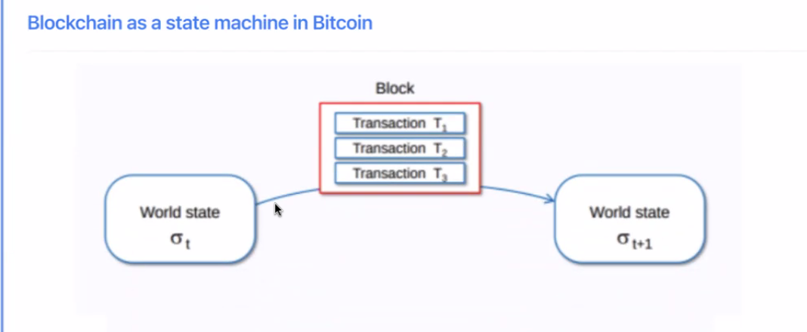

# Solana Bootcamp Q2 2024

## Lesson 1 - Monday - 6/3/24

anchor framework.

sli.do application. During lesson.

Discord Readme channel.

security auditing and development. But education is big focus.

IMP - put this in your overall knowledge category.

game theory -use economic incentive.. 

Imp = check the slide again what he said about this above pic.. 9:11AM. 

Data - little bit.

Imp - have chatGpt break down - Elliptic curves.

taking a point on curve and then take another point to guess something etc. .

diff algo work differently.

https://github.com/ExtropyIO/SolanaBootcamp

Slot- timestamps. Epochs.

Link before this - parent blockhash.

Child slot;;

Details of txns.

Block size is important factor.

IMP - what's BTC blocksize and WTH?

explorers:

TXns dont get picked up right away and are in pending state.

Ex BTC - 10 mins - mempool can get large. 

but ETH and SOL it ets complicated. MEV 

IMP - MEV - 

its public people know what Txns are happenning. Nodes can decide what to use based on that.

Block producers can extract more value. 

higher Txn fee they can pick.

lot of demand - large mempool.

Solana used improvements .. around scalability and speed. 

message works within Solana. 

Gossip protocol was unstructured way and unfocused. not geaographic proximity. etc .

mechanisms to improve on that. 

SOL - more targeted.

we know who the block produceer will be - so why dont we just send Txn to that person - then they can put in the block. Then they can pass it around. initially only producer needs it.

So main thing we know who wil be Leader (block producer).

This reduces load on the system. IMP - to make it more scalable etc

Deterministic Leader! IMP

QUestion - 

If we only send the txn to one single blockproducer, wouldn't that introduce a sense of centralisation? what if they don't include our txn?

Erick Fernandez

now

The rotating leader schedule reduces this risk by sending transactions to multiple validators

IMP - listen 925AM.

9:28 - concurrency.. listen again.

Txn 1 , 2 and 4 can be separated things out and run paraellel and then Txn 3.

IMP - gossip protocol - listen early and also research.

### Proof of History

There is no Clock available.

Block producer sequences Txns.

### Consensus 2 parts

random function used by some blockchains.

### liveness

if no producer is chosen? 

in BTC eventually someone will solve the puzzle.

If you assign slot - what is person chosen if offline or cant produce one? 
Then how do we proceed. part of the solution could be based on time slots.

Then next slot can produce the block.

So we need reliable source of time.

BFT is general name. 

Nakamotu consensus. 

crypto economic incentive to behave.

voting takes place among certain nodes - they dont scale very well. Since once you have lot of nodes it takes time. 

If some nodes dont vote.. some faults system has to proceed

Lesson 2 - 

there is no centralized auth for time.

hash - commit scheme that are binding. one way functions.

this has to be done sequentailly but we cna verify in parallel.

### homework

Question - 

Anonymous

15 minutes ago

Could you share a link to some resource on how solana manages to sync everything so quickly?

Erick Fernandez

13 minutes ago

Here's the Solana whitepaper: https://github.com/solana-labs/whitepaper/blob/master/solana-whitepaper-en.pdf

## Lesson 2 - Tuesday- 6/4/24

20:26

Lesson -2 - 🕉️🕉️🕉️🕉️

Solana.com collective - core teams 

18:22 - join talent later - to meet people , meetups etc super teams 

14:59 - community pages .. not all maybe up to date 

Good ChatGPT question - how is global time maintained by Solana 

6:58 - 2 article links 

2.35 - leader schedule generation algorithm- screenshot - use ChatGPT to understand 

Need to revisit lesson 1 - concept of time was introduced & that’s what makes Solana scalable. In the beginning 1:00 itself he says about last lesson. 

https://youtu.be/gDzjyPgtFEk?si=vl_nw24DmHY8VHVz

### Rust - 

21;37 - 

Diff to many other lang - 

memory safety. w/o affecting performance of run times. 

So far lang used gargave collection - we used to stop program and remove and make space avai;ble and code ran again. that can affect perf of code. but we do need something to remove something we no longer need in memory. 

We need to be careful to do in safe way. Dont remove too soon. We need to know lifetime.

Careful w concrurrency - 2 people trying to update same data, ... we dont want data races. 

that really informd design of Rust. 

They created rules as compilable checks. Follow some rules then memory gets handled correctrl.

More things checked by compilter since its addressing memory safety.

#### `mut` modifier

Types language.

it tried to figure type but gives error if it cannot.

compound more complex type

x.0 - access items.

#### vector

macro. 

heap - manage carefully.

we dont have to worry about stack as much as heap.

same type.

static in Rust.

cant delete or add item. Size has to be same.

Slice - window of an array. 

Rust does not let you do implicit type conversion - 

returns bool;

last stmt is bool; thats a return.

final stmt no semicolon needed.

#### loop 

#### option

#### Result

ok or error

#### <Option<T>

- None 
- some (value)

45:00

### 59:36 - wallet, key pair 

### 56:28 - Solana cli 

### 52:51 - rust playground 

### 52-12 - learning rust links 

### 50:00 - install Rust 

### 51:19 - cargo 

1:00:00 - Solana config command , airdrop , transfer 

### airdrop

### transfer

### memory - heap stack 

1:03:00 - memory - heap stack 

Old language you keep track of memory & remove when needed . 

### Dangling pointer

### In rust- Ownership 

### function passing argument

1:15:00 -- function passing argument loses ownership- check in ChatGPT IMP 

### references- shared & mutable 

1:19:00 - 2 types of references- shared & mutable 

**<u>Imp</u>** - read the lesson best 

# Appendix

## Lessons-knowledge

### Zero Knowledge: Episode 135: Look into Solana

Jun 24, 2020

https://podcasts.apple.com/us/podcast/zero-knowledge/id1326503043?i=1000479550750

#### hardware-based scaling layer

“So tell me a little bit about what Solana is.

So like a big part of what it is, I think actually comes from the team. So myself, operating systems geek, I worked on Brew, Android and like Linux and every permutation of those things. Greg, who's the CTO, he was actually one of my friends back in those like, trying to build the Vonage days in the UIUC.

He is a compiler's expert. He basically worked on languages and compilers the whole time he was at Qualcomm. And our buddy Steven, who was a GPU lead, started Intel, but also ended up at Qualcomm.

He is like the kind of main go-to for any kind of optimization. So Solana is a layer one blockchain smart contracts platform. But it's really like, if you wanna know anything about it, **everything that we're doing is optimizing the hell out of every possible thing that a blockchain would do at the hardware level.**

**So we're horizontally scaling everything we can by using hardware**. Like basically, is there any operation that's a bottleneck that if **we add more network cards, we get more like packets per second**. 

**“If we get more SSDs, can we do more reads and writes, more state reads and writes**

If we add more cores, can we execute more transactions? So the whole idea is that like, the stupid CryptoKitties example that everyone brings up when they talk about scaling, what should have happened is that the people that were seeing the spike should have just doubled the number of cores in every one of these validators or miners, and there wouldn't have been this like, the customers wouldn't have seen an outage, right? This would never happen in like a web company.

That's just like, holy shit, we're hitting like a million multi-active users. We didn't expect they would just double the number of cores in AWS, right? And to me, this is like a fundamental problem.”

https://chatgpt.com/share/615d89cc-543f-4049-b080-75cb643cb078

“If you can't do that, then you haven't solved scaling. If you can't throw hardware at it, you haven't solved scaling. So everything we're doing, and if you want to know anything about Solana, is that like, this is a hardware-based scaling layer.

What is the origin story of Solana?

This was like a weird experience, like a very strange level. Like I had like two coffees and a beer, and I was talking to my buddy about proof of work and why it sucks. And I like was up till four in the morning, and I had this like eureka moment.

It felt like, I don't want to say religious, but like an acid trip or something, right? Like it was just like this massive white bulb went off in my head that **I can use SHA-256 and use it recursively and generate a data structure that has, like you can measure time with it**. And why that to me, that was like such a big kind of punch to the head was that like, I don't know, Georgios, you probably know this.”

“There's like this Italian guy that wrote about like, there's like five universes and one which there are reversible functions, right? And one that the reversible functions exist, but we can't prove that they exist, right? The irreversible functions exist, but we can't prove that they exist.

And the universal functions cannot exist and we can prove that they cannot exist. And what he's talking about is like, there's no mathematical construct for the era of time. There's nothing in math that represents time, right?

This math represents every kind of other physical property, but like, there's nothing that represents time moving. And take this thing that generates data purely in our math, that from that data alone, you can have objective measurement of time. That like, was just like, holy shit, this is the era of time.

And like, I couldn't even figure out what to search for. There was nobody working on VDFs that openly at the time. And I didn't even know the term VDF.”

DONE-----

“That was going to be my question.

Right. So I searched a lot. The only thing I saw was like RSA time locks, which were fairly similar.

And like nobody was using them in crypto for anything interesting. And why I was so obsessed with the time component was that all these years at Qualcomm, the wireless protocols just kind of get hammered into my head. And the first wireless protocol anyone's ever built is like, imagine two radio towers.

They talk to each other at the same time over the same frequency, they get noise. So the first thing that people did was like, let's give everybody a clock and alternate by time. And that's called time division, multiple access.

And this is how you scale the number of participants per second, which is same problem as block producers per second, right? If we can stagger the block producers by time, there's no collisions, everybody gets to take their turn, and we get as many block producers as possible. So that was like, oh, okay, I can do this whole thing.”

“But the VDF research was actually happening potentially in parallel to what you were thinking of. Did you at some point realize that it was happening, that it had a name?

Yeah, so I quit my job and started writing the white paper and talking to a bunch of people. Basically, this was an easy time to get into crypto because it was blowing up in this very obvious way. Bitcoin was doubling every two weeks or something crazy.

And I ended up running into Zaki and Zaki talked to me and he was like, okay, you have something that isn't bullshit and it's called the verifiable delay function. You should go look at all these papers. And the interesting part was that I looked at all these papers and at the time they were way over my head.

I'm an operating systems engineer, right? Like throwing myself into like class groups and our say accumulators and all this other stuff. It was hard, right?

“This was like a lot of learning. But the cool thing was that like the thing that the stupid chapter 56 loop that I designed after talking to some folks like Dan Bonnet, he was like, well, you have actually works really well. So don't change it.

The stuff we're working on right now is iterating so fast that it's just going to be outdated by the time you guys implement anything. Right? So I got like the blessing from some of like really important people.

I was like, okay, I'll just, we'll just go build on this. And that was, that was like good enough. And it turned out to be like a fairly good choice because like we quickly realized that the silicon, like the people ship like Intel AMD, it is basically the same everywhere.”

“And we have almost no drift between Shout to 56 running in an Intel chip or AMD chip or any other architecture, like TSMC, Intel, they're all basically like at the latest and greatest material science as possible. And they can't really squeeze out and beat each other by like a large margin. So that like, that ended up being a fairly good kind of bet because the really amazing work that folks that are building VDFs like Justin Drake and all those guys, they're building something that is not yet optimized down to this like gates, like pipeline latency level that shout to 56 is that Intel ships like here's like the fastest shout to 56 our engineers could build.

And it's gonna take you a big pile of work to make it any faster.

We actually did an entire episode on VDF with Bonneau, who is one of the co-authors, I think with some of Dan Bonnet's students. So that's actually an episode I'm gonna add in the show notes for you to better understand what he's talking about. But it sounds like your VDF is very different.”

“Do you call it a VDF?

Dan Bonnet did say that I could call it a VDF, but it is an embarrassing implementation, it's an embarrassingly stupid way to do it. But it's so simple that an operating system engineer can make it secure. I don't have to understand that much about cryptography.

It's a recursive SHA-256, which means it's because it's recursive and SHA-256 is pre-image resistant, there's no way to parallelize the process. That's kind of obvious to me at least. And the way we speed it up is a very dumb way is we just checkpoint the data as it's produced and then we verify the samples in parallel.

And because us as people that work at Qualcomm and are very familiar with hardware and SIM delay and single instruction, multiple data lanes and GPUs, we can take any one of these kind of scaling solutions like that are chip level scaling solutions and use that to speed this up. So, your phone right now has, I think, a thousand SIM delay in its GPU. So you can verify a second in a millisecond and that's good enough.

But it does cost data.”

“Could you perhaps expand on how the verification is made faster than the evaluation? Because my understanding is that, yes, you do a sequential computation where you just keep hashing.

It's exactly the same amount of CPU time. It's just the verification is parallelized. So it takes less time to verify than real time, right?

Because what we care about is real time that when this thing transmits a block, whoever receives it in real time can verify it faster and the block producer has the forced delay.

Right. So what I was thinking is that as a validator, in order to know who the latest block producer is, I need to have the latest state of the hash chain. Is that correct?

This gets into everything else that you have to build on top to build the blockchain, right? This is like the simplest part and this whole VDF thing, the key part to this is this is a way for us to track time before consensus. Before there's been any consensus, we have this Lamport clock, this logical clock in the network and the logical clock part of it isn't the hashes itself, it's the count.”

“I actually like the count is what's important. Like a block producer shows me that they reach count 1 billion and the next one shows me that the reach count like 1 billion 200 million or something like that, right? Like this, like the amount that they're adding to this data, right, is like the interesting part.

That's the logical clock moving forward, that's the arrow of time. The state, right, we leverage as a mechanism to kind of keep track of transactions and when they reference a particular hash value, that's our kind of like mechanism to make sure the transaction was signed after that thing was generated, things like that. So to answer your question, like the how we do actual like elections or like scheduling, is a very, very dumb way, again, like we do with the simplest thing first is based on some prior state, we generate a leader schedule, which just basically assigns some stake-weighted deterministic seeded round robin fashion of which validator based on their stake-weight is assigned to which slot and that leader schedule gets turned on and plus one epochs, right?”

“So, based on epoch one ends, right, and epoch three gets the result of the state calculated by the end of epoch one, which means that this machine halts if we can't find a final state within an epoch, right, if we can't finalize a block within an epoch.

Is it based on anything that already existed? Is it taking other models? Is it taking an existing blockchain and sort of adjusting it?

Yeah, so like, I personally believe that every proof of stake implementation is some form of PBFT. We based our thing on PBFT, although we kind of did a lot of modifications. And MN would like scream and tear that there's no proofs, but like, hell, it works, so.

Which is fine. The bytecode is using Berkeley packet filter, which is not WASM. It's bytecode used by network switches.

So it's designed for kind of high performance, low latency stuff. It's got interesting properties, like there's no stacks, there's only stack frames. So you can take this bytecode and execute it like a kernel on a GPU.”

“So single instruction, multiple data. So again, in that CryptoKitties example, right, we have a single contract for hitting a spike. Because it's a single contract, it's a single kernel.

Most of the transactions are going to take the same branches. We can run this kernel on a GPU card, which has, let's say, one execution thread, but 80 lanes per thread, right? And then like 80 execution threads total.

So that's how you scale stuff on GPUs. So we do stuff, we do like tons of stupid tricks like that, which end up reducing the cost of the execution, right? And therefore reducing the cost of the blockchain and things like that.

Is it based a little bit on like the Ethereum model though? Like, do you have a VM? Do you have a statement?

Like, is it set up that way?”

“We don't have a VM. Like the EVM is like very academic. So the way we've designed it is more like if you look at the DMA, the direct memory access to hardware and Linux, and this concept of scatter gather, where the memory that you put, where people need to understand what a von Neumann machine is, right?

You have basically memory, right? And that memory is just bits, right? It's bits and those bits are grouped into cells, like pages or bytes or however you want to do it, words, and they have addresses.

And these things are flipped by a separate part of the machine with CPU, right? And this thing is like getting instructions from the memory. And then those instructions say go load and store stuff, right?

And you take this model like at an academic level and this is what EVM kind of tries to do, right? There's specific load instructions or store instructions and they say, why don't we have 256 bits for everything? Hardware like at the actual implementation level is much more complicated because now you have caches and L1 caches that are in the L2 caches and L3 caches and “points unification that are weird and prefetches and all this other stuff.

So what operating systems do is they force the programmer to tell them ahead of time everything that they want to do. So when a programmer wants to load a bunch of textures and run a bunch of transformations over those textures, they actually have to tell this thing ahead of time. Here's a bunch of resources I need you to go fetch from disk.

Here's a bunch of stuff I need you to load into these regions of memory. And these are the kernels and things that I'm going to run over this memory. And all this is known ahead of time, and then this hardware is programmed and then it executes.

I mean, you're kind of, you don't need a VM because you're leveraging the bytecode from the Berkeley packet filter as your runtime is my understanding. Is that fair to say?

No, Berkeley packet filter is just a bytecode, right? This is what LLVM poops out. And that part we picked because it's been around in the industry since the 90s and it's safe to run in ring zero.”

“But the important part is that we don't have individual load and store instructions. All we have is an entry point into executable object and LLVM position independent code, right? And that entry point says, this is the memory I'm going to read, this is the memory I'm going to write.

So, you're saying that you're not operating on a per address, per instruction level to do loads, but you're just loading full pages of data.

Exactly.

And you're kind of amortizing the cost.

Exactly. And because each transaction tells us ahead of time, all the regions is going to read and all the regions is going to write, that means we can pipeline and overlap and...

You can pre-allocate also.

Exactly. We can do everything. This is how hardware gets built and shipped.

And the EVM design is very academic and it's going to take, I think, a lot of engineering effort to take this academic approach and underneath it implement what we have. You can do it. It's just going to take a big pile of work.”

“A question on this. So the performance bottleneck that comes for using the EVM, it's not entirely, of course, the EVM has some downsides on the performance, but also it has to do with cross contract calls because when you call multiple contracts, you effectively have to take a new text on all the shared state of these contracts. So how would it work on Solana if you want to do a cross contract call?

The transaction specifies all the memory it's going to read and all the memory it's going to write ahead of time. So there is no mutex to take. The transaction itself is the mutex, right?

It's got, I always mix up these two database terms, but I believe it's called isolation.

So what if two transactions are sent and they both want to interfere with the smart phone drive?

The contract is position independent code. It has no state. The transaction picks some state that it wants to mutate or read.

And that's the state that's spedified ahead of time by the transaction itself. The contract itself is pure code. It's just instructions.”

“Which is different to how Ethereum smart phone drives are because Ethereum smart phone drives do have states.

Because the code mixes in globals, right? And the first rule that you learn as a programmer is never use globals for anything. At least as a seed developer, right?

You're like, no, no globals, right?

If we can get back to your point about the consensus of the system, you said that you use some form of modified PBFT, which I recall reading about. However, in your documentation, you have a big section on fork generation. While to the best of my understanding, PBFT and all BFT algorithms do not have the notion of forks.

It's just you have the latest state and that's it. And then you keep moving. Is there a quick explanation on what's the difference?

Yeah, yeah, yeah. So basically, what are the two techniques to make things fast, right? One of them is, that's obvious, is you use a global clock, right?”

“But if you have a bunch of, if you're doing a bunch of protocols, if you have a global clock, right, you get read consistency, right? I sent you a bunch of messages, I sent Anna a bunch of messages, and you guys order them exact same way because you have the same time steps, right? So that amortizes that communication.

The other go-to optimization is basically using a window, Nagel's protocol, sliding window, right? You receive a bunch of data and you don't respond until, you don't respond on every message, right? You receive a bunch of it, you batch the processing and then you respond on the entire slot.

And effectively what we did is like, we still have to do PBFT because we have to come to some conclusion on what the root block is. And all we're doing is allowing the network to slide that window out of how many states have been produced.

And the number of states may define the number, may introduce some branching because you're kind of building, you might build on unconfirmed state.”

“Right, exactly. That's it. Those are the only two go-to things.

None of these are like computer science, like yield metal things. They're like stuff that engineers do all the time.

So is it correct to say that you're able to get very quick blocks by kind of optimistically building on top of unconfirmed blocks?

Exactly. Yeah, everything is optimistic.

How does this relate to... I'm just thinking about speculative execution attacks in this context. So is there any way that I can kind of force one processor to go the one way and the other way and introduce some consensus error?

Yeah, not an error. It's just that... So this is kind of my intuition and it's outside of my expertise to prove this kind of stuff.

But I think like Zaki called it asynchronous safety, right? Like you're producing state and the safety is actually following the head pointer of the chain. And me as an attacker, I can actually prevent my data from being propagated and I can observe what the chain is doing.”

“And I could potentially then transmit my data at the right moment and effectively force all that computation to be discarded.

Yes, that's an issue with all synchronous protocols.

So because we have this window, the attacker now has a larger set of data to play with, right? They have a larger set of states, right? They can manipulate potentially more things.

So I would assume that there's bugs there, or not bugs, but exploits that could allow the attacker to extract more value, you know, potentially like allow them to generate more rewards than anyone else in the network that's not doing this attack or do denial of service, right? Cause the fork to drop blocks and necessarily things like that. How much of that is a problem is unclear because, like, if that stuff is observable, right?

The attacker is in a proof of stake system, especially like a deterministic one like ours. The validators are well known ahead of time, right? “The block producers are well known ahead of time.

You end up in a situation where you know that like, hey, course one is like explicitly dropping blocks of every other validator and there's like trying to do a censorship attack. Why, right? I think we need like a lot more product market fit in the space for us to worry about that.

That's interesting though that like one of the protections here is the reputation of the validators and the fact that you do know them at the moment. I wonder like this, if you look at the example of like mining, it also started out very friendly and everybody knew each other and could kind of predict how they would act. And eventually, I mean, I guess it's still known, but it became much more aggressive, much more competitive.

Like would there not be a time where one of them gets strong enough or there is some sort of backroom coalition and they're not that friendly?”

“Possibly, but that could be after product market fit. And yeah, so like I think like there's like a fundamental difference between I think proof of work chains, especially one that Bitcoin is trying to be, which is like no weak subjectivity whatsoever. Like this is like proof of work to the max from a proof of state chain that's trying to be, we're the fastest possible censorship resistance state transition engine you could think of.

They're like two separate things, right? Like I think the proof of work use case, I can see it being a store of value, right? There's like some really interesting properties about Bitcoin and how the mining works and like how security is aggregated and things like that, that are, these properties are not there in any proof of state system that I've seen, right?

And I can't claim that we are going to be a store of value because I don't see those properties, those emerging properties out of those. Unless maybe we get to a point where we have so much censorship resistance that, I don't know, you have to corrupt like a million parties to actually, to break that, right? “That's like a long ways away, right?

I wonder, so I like this sort of, so using the term product market fit for whether it becomes a store of value or like, this is interesting. I haven't actually heard that in that context. So I'm, how are you thinking about finding product market fit and where do you see yourself going?

Yeah, like, I mean, like, I mean, the bet we're making is that the number of companies that have like enough users to where they care about transaction fees and the slowness of Ethereum and all this other stuff, there's enough of these companies already and enough that that number is going to keep doubling every year, right? Because just the space is going to grow and they're going to pick the chain that will give them the best web experience. And that means lowest latency, cheapest transactions, because what we're competing with, I think fundamentally, isn't like Ethereum, it's Google Ads, which is the value of that transfer, right?”

“Of a Google Ad is 0.2 cents and it comes at you in 200 milliseconds. So this is like, we need to be like a hundred times cheaper than a Google Ad for a web company to consider replacing ads with cryptocurrencies and creating social network effects from those cryptocurrency usage, right? To where they're getting the same kind of revenue as if they would have had ads, but now instead it's just currency based, right?

And then we are the platform where this stuff runs. So we have to be much, much cheaper than an ad for them to consider replacing ads, right? So to me, this is what I'm competing with is in my mind is like, how do we get rid of like this parasitic form of money, which is like sucking your attention, right?

With like a more fun form of money, which is dodge. Like dodge is an awesome idea, right? I mean, coin.

Oh, you mean like doge?

Doge. I call it dodge.

Dodge, dodge.”

“Yeah, doge, doge. Well, I'm born in the USSR, so I pronounce everything incorrectly. But yeah, stuff like that, stuff that's fun, right?

The internet is supposed to be a bunch of fun things. For that stuff to work, it needs to be super, super cheap. Like basically free to the user, where the company can subsidize it.

And this is what the goal we're trying to make. And I don't think it's unreasonable, because the cost of the hardware is ridiculously cheap. 50 bucks buys you a terabyte of egress.

Terabyte is 4 billion transactions.

Is the goal for Solana to have only validators or block users to run the nodes and then consumers of the software that gets written on it just interface with Solana via these buffed up nodes? Or do you see users running their own non-block producing nodes so that they can create a transaction locally or verify the state so far?”

“I mean, if you have censorship resistance, then you can just basically trust your like client. Because you trust that this group of keys signed the right thing. Because the thing, your group of keys that you're using for your like client is based on the censorship resistant network.

So with a like client, that's kind of a... Where do you draw the line?

I mean, it's not just about the censorship resistance or the liveness of the system. It's also about the safety in the sense that no validator did not commit a transaction which gives them a million tokens out of nowhere or something like that. In Bitcoin, for example, miners may censor transactions, but if 51% of the miners or whatever try to produce a block that gives them a lot of money out of nowhere, that block will not propagate because full nodes will reject that block because it has an invalid transaction.

While if there are no...”

“Yeah, so we have slashing, right? So anytime you do something that the rest of the network doesn't do, you get slashed. And that sounds like no worse than Cosmos in terms of safety guarantees or economic...

The economic game theory about the security of the state is based on slashing effectively. So the interesting thing is that we're hugely fans of weak subjectivity, which is, I think, a funny way to...

Checkpointing.

Which is a funny way to just use the old security paradigm, which was TOEFL, trust and first use. You observe something, you trust it in first use, and then you verify that it's still the same thing, but you trust it. So TOEFL, right?”

“If you're a user, you connect to the network the first time you trust it at whatever state it is, and then you continue to trust it based on that state. And based on that, one is that any kind of state charting techniques that Ethereum is working on, awesome folks, those can be applied to temporal charting, which is like, I run my validator today, and then I run it a month from now, I get all the proofs about data availability and verification and economic guarantees a month from now, and I'm like, oh, okay, it's consistent with what I observed a month before, right? And I can continue.

So you can make it like as, you can get the same guarantees there, but for now, what's implemented is just basically tofu, right? You connect to the network as long as you stay connected, you can continuously verify that the same set of validators are validating the exact same state. There's fairly easy ways to catch up because main bottlenecks are like the cryptographic operations, right?

So those are truly parallelizable because you can farm those out on like a big cluster of GPUs and run all the “the signature checks independent of each other.

I guess we've been talking about quite low-level stuff all this time and the podcast is called the ZK Podcast. So I think the question I have around this is do you see Zero Knowledge proofs leveraged in Solana to make running a node more manageable?

This is so cool.

Yeah, yeah, yeah. Or like...

It would be awesome.

I'm thinking of something similar to Celo's Light Client Protocol called Plumo, which I believe also was recently on the podcast.

Oh no, we had it at the summit.

On the summit, right. So I was thinking that is there any room for further optimizations utilizing Zero Knowledge proofs? Is anybody in your team doing that perhaps?”

“I mean, 99% of the work in this is data availability, right? This is a lot like if we're working in core, it's like working on the network protocols and optimizing them and trying to get this data faster across this global internet. Some nodes are behind the Cheney's firewall, right?

There's a big pile of work just there. So this is really what we're working on right now. I think there's a lot of interesting things, right?

There's stateless VMs where you just use RSA accumulators and things like that. What I need to observe is a very small chunk of the state and then everything else not only contains... The memory needs to read, but it can also contain a proof that that memory actually belongs part of the state.

And stuff like that could... There's a lot of optimizations that are super interesting. We haven't had a need for them yet.”

“I think fundamentally what I'm imagining these things are for isn't like a messaging platform. I think the goal of these things is actually to accumulate as much data as they can and make it atomically accessible. And this is why I think philosophically sharding will fail.

Because it's not atomically accessible state. And the fact... It means that if you have atomically accessible state, like I have one giant enormous state machine, let's say it's a petabyte of data, this isn't just regular data anymore, right?

It's data that is globally agreed upon, and those bytes have value, right? And we can atomically do transactions on them. And we have this enormous price discovery engine that's constantly like effectively removing the entropy in the state, right?

It's like optimizing this things down to the lowest possible price difference between any of these states. So this is like a very complicated engine of price discovery. And when you start it or you split it over, you lose that.”

“And then all you have is just a messaging system. And to me, that's not interesting. To me, what's interesting is like how do we get the world's like most relevant information that has anything to do with anything of value into a single giant bucket and have like the best possible price for any of these bytes?

I mean, but do you think then does this also categorize sharding systems just as a different use case? Like going back to product market fit idea, like is it just that they'd be used for different things or different types of projects?

But what if they're slower and more expensive and like worse engines of price discovery? What is the use case?

I think the use case here is decentralization, keeping the node running costs very low, because as we said previously in the call, as you increase throughput, clearly the hardware requirements increase. Sorry, I might sound like a broken record at this point, but I just want to like clearly communicate my point in the sense that sharding allows you to scale while keeping verification costs low. And that's also in the same sense as what Layer 2 is “is supposed to do.

But while in your case, indeed, you're able to scale because, you know, adding more GPUs or disk space is cheap, you're relying on this assumption that the cost of acquiring more computer storage grows subliminally with the demand. So, you know, if, yeah, so I'm not, I'm not exactly sure slash convinced that this is, you know, a sound assumption or perhaps how do I say, what do you do if this assumption breaks?

I just wait two years because then it's going to be, because hardware is going to get twice as cheap.

This, by the way, though, the idea that sharding will fail. This is the first time I've heard this said.

I have a whole podcast called No Sharding.

Oh yeah, that's true. This is your, this is your mission to basically say, this is the information you're bringing to the, to the conversation”

“To get away from the subjective bullshit, let's decent the whole purpose of decentralization. The only function of it that's objectively measurable is censorship resistance, in my opinion. If I have censorship resistance, I can build whatever decentralization features you want on top of it, as many readable nodes.

And regulatory arbitrage.

Exactly, like all you need is censorship resistance. So imagine I have two shards of 200 nodes each, right? Binance is in one, Coinbase is another.

It takes 67 nodes, let's say they're all equally staked. Any 67 nodes and any other two shards can control the flow of funds between these two massive financial institutions. And the reason why I sharded is because I need, I can't grow my committee, right, above 200, because we have this limitations based on software protocol or hardware or whatever you want to call it, or philosophy.”

“Now, if instead I took the same cost of hardware and just had twice as more powerful machines, right, that committee can now be 400. And now it's 137 machines that control the flow between Coinbase and Binance. And that's more censorship resistant.

So if the thing that we're trying to build is censorship resistance, then what we need to be maximizing is the number of nodes, the minimum number of nodes that it takes to get to 33%. I don't even know if this is possible, because proof of stake sucks. It's centralized.

It's just like people are bad. They go to exchanges. They pull all their money in the exchange validator.

So I'm not 100% sure that it's even, if this is even possible, but I'm pretty sure that sharding is not going to get us there. The stuff that's not possible, I think, is the human behaviors around actually participating in those networks and the governance of it.”

“But again, the issue is that in this situation where you have one big chunk of data that all validators vote on, that the cost, the communication cost, as you just keep adding more nodes in this context also grows. While again, in the context of sharding, each shard is independent of each other and they just checkpoint their state. And you only have the overheads for, due to the cross-chain transactions, which that's what you are trying to minimize.

Sure, but no, it's not about cross-chain transactions, I'm trying to increase censorship resistance. This is the only point of decentralization. With the setup where you have a single committee and you throw hardware at it, I can take dollars, I can take fiat, I can take the work that we do as humans and I convert it into censorship resistance.

Sharding doesn't achieve censorship resistance because when you shard your groups, you're also splitting your set that can decide where stuff flows. To me, this is the foundational problem of it.”

“What about the beacon chain or the central body that's supposed to actually fix for that?

I'm Binance, I'm in Shard 1, Coinbase is in Shard 2. I don't give a shit about the beacon chain.

You just act within there.

There's some hedge fund that bribes 67 nodes to control the flow between these two massive trading financial institutions and is now gaming the system and earning a return based on that. This is kind of like that's going to happen if it's possible. If it's possible for some fund to bribe the flow of funds between these two organizations, they'll do it because there's enough money on the line.

But why would you only need to bribe the controllers of the one shard?

Georgios, tell me I'm wrong, but when you split your committee, the minimum of any one of those committees can decide the flow of funds.”

“The idea here is that you make an initial assumption that some percentage of the total pool of the validators is honest, and then you try to distribute these validators to a shard. The whole idea is that the way that you distribute these validators to the shard will not break the assumption.

Because it would be random in a way or something.

This is called the static adversary model, which assumes that an attacker that gets assigned to a shard cannot adaptively corrupt another shard. This would indeed allow them to cause bad things to happen.

If they could.

Maybe that's a fine assumption.

Maybe that's a fine assumption, but other people, for example, near people are not convinced by it. And that's why we have multiple different approaches to solving the problem.”

“And it's fine, right? Because at the end of the day, all of us are trying to get to the next level where we slay the vampire squid, right? We're not even talking about Binance and Coinbase at this point.

It's like the other guys, the Goldman Sachs, everybody that's siphoning 20% of the world's GDP into bullshit, just moving numbers around in computers and a lot of people. So from my perspective, it's fine. People should try all this stuff because I don't know, it's even possible that because you can allow more people to participate in these networks because it may be cheaper, that may be more important than censorship resistance.

That is, I think, a point that I don't want to miss, right?

Because a big part of these networks isn't really the actual tech, right? It's actually the community that's built around some philosophy.

The values that they hold.”

“If they believe that this is decentralized, even if it's wrong, right? If enough people believe it, then there's enough social pressure to where this kind of corruption is very hard to achieve in reality. It may be theoretically possible, but it may be so devastating to the community that no token holder that's sufficient enough would actually do it.

And this is, I think, is missed. When people publish attacks in Bitcoin, I think they also missed that part. Binance had like 40 million of their Bitcoin stolen.

But the suggestion was that why don't they just publish a private key or actually issue a transaction with a high enough fee to unroll the chain? Because 40 million is like, I think, four days. Or at the time, it was four days' worth of blocks.

So they could literally write a transaction with their old private key, right? Four days ago on a block that's, I don't know how many blocks it is, but a few hundred blocks, let's say, that says, hey, I'm going to pay the miner an absurd amount of money to go create a parallel fork and unroll four days' worth of Bitcoin.

“But I guess that's a feature, not a bug, right? The Binance reorg story.

But Binance wouldn't do it because they hold so much Bitcoin that the threat of a four-day reorg would devastate the price and the confidence that people have into the chain itself. And I doubt the miners would even do it if Binance tried. If we were going to get a little bit more meta, then the tech doesn't even matter.

What matters is, can you make the people that participate in the network believe that this is decentralized and censorship resistant?

And have their incentives so aligned that it would be such a mistake for them to... They would lose more by screwing it up than they would gain.

Maybe we can again get a bit back on the privacy story because we are, after all, as we said, in the CK Podcast. So what is the private story about Solana? Have you thought about it?

Have your users asked for it?”

“We thought about it and that's about it. I think like...

You're so not into privacy.

No, like it's a super hard problem. Zero Knowledge stuff is not our area of expertise. It is something that is an absurdly rapid research.

So for me as an engineer, when I look at the stuff and I see... When I ask the experts, what should we actually even look at? And what they point me is a paper that's been published two weeks ago.

I'm like, this is still too in flux, right? Just like... Yeah, because two weeks from now, you're going to point me to a different paper.

And honestly, the only thing that I've heard that's worthwhile, if we add to some, I don't know, big enterprise bank says, we want privacy. We will use Solana and we will give you a lot of money if you give us privacy. What we would use would be Sapling, like Zcash.

Something a little bit more proven.”

“It's been around for so long that I feel like the bugs have been mostly weeded out. Zcash was around for like four years now, right?

Yeah, ish.

So I feel like there's 50% chance that there's not going to be a catastrophic bug in Sapling in the next four years.

Although Sapling only came out last year, I think. Because that's an update, right? Like Sprout was their first one that did have a bug.

And then Sapling or bug, there was like a missed thing.

Sorry. So on a more, again, a bit lower level on this subject. So Sapling is built on the UTXO model, while my understanding is that Solana is account-based.

But you can map one to the other one.

I'm not sure it would be as simple.

So the way we kind of think of our runtime is we can actually support more than one virtual machine or more than one interpreter of the state. Because again, contracts don't have global memory, right? They're just bytecode.”

“So you would run Sapling as a VM inside Solana. And the stuff that you're executing in this Zero Knowledge environment, that's what the customer wants.

Oh, I see. So it would be inside an app inside Solana, that within the app, everything is Zero Knowledge.

And nobody cares if it pays for the gas.

Kind of like a shielded pool.

Yep.

Yeah, okay.

Do you have any plans to integrate Solana with any other networks? Are you thinking of bridging?

Yeah, Terra is actually building something, which is pretty cool. But like, IBC is interesting. All this stuff again, like my experience engineer from Qualcomm, it's very boring.

I'm like, this is too new. You can't, how do you trust like millions of dollars to this?

Are there any plans for Bitcoin on Solana?

Like TBTC?”

“Yeah.

That kind of thing?

Pick your flavor of mechanism. If you know a big customer told you, we want Bitcoin on Solana.

But is it Bitcoin?

Yeah.

Is it actually Bitcoin? Is wrapped Bitcoin Bitcoin?

Oh, well, I'm not sure from a tag, I think, depends on who you ask. If you ask the IRS if BTC and WBTC are like kind assets, maybe, I do not know.

But like the whole point of why would you even want BTC, right, is because you want this like settlement into something that has like the security properties of Bitcoin. Or you're just trading. If it's just for trading, then yeah, we can give you an Oracle price feed at 400 milliseconds and give you BTC exposure.

Right?”

“Yeah, so you would do it like a synthetic. So if somebody wanted to have access to Bitcoin, you would do it like a synthetic. That makes sense to me.

One of our validators, Steakfish, they're like part of the FT mining pool. It's not like people wouldn't trust them, right?

To your point though, I think you made an important distinction in the sense that when people are using Bitcoin, they care about the settlement assurances, that the thing that you just transacted in, it's very unlikely to get reverted and it's very likely that your transaction will go through.

It's not that a transaction, no, it's that me as a custodian, I am receiving the Bitcoin and it's now settled with me. It's not that you and I exchange in some centralized exchange for Bitcoin. I mean, that is where almost all the trades, right?

But to me, the fundamental value of Bitcoin is that somebody across the world can transfer a billion dollars or arbitrary amount of dollars and it can settle immediately. And that settlement is guaranteed, right? With this like a massive amount of electricity, right?”

“That part, I don't know what TBTC or RAPTC doesn't expose that, right? The settlement risk is hidden from the user.

The security model changes with additional assumptions being baked in. Well, I guess in the case of a TBTC or a Bitcoin on Ethereum kind of thing, you're switching your security model from whatever electricity is being consumed in Bitcoin to whatever electricity is consumed in Ethereum, plus some additional mechanisms introduced in each system, whether that is the fraud proofs and whatnot.

Do you believe that proof of state networks will have the same level of security?

No, I'm a proof of work guy on that end.

And yet you have a proof of state network, don't you? It's Solana's proof of state.

So security is only one parameter, right? I honestly believe that proof of work is web scale security. Bitcoin itself has managed a way to capture security at a global level.

It is more secure than like probably the Golden Fort Knox, right?”

“So thank you for coming on the show, Anatoly.

Thank you, Anatoly.

Thank you so much. This was super fun.

And thanks Georgios for guest hosting. And to our listeners, thanks for listening. Thank you”

