# Solana Bootcamp Q2 2024


## Day 1 - Monday - 6/3/24 - Intro Blockchain, Rust & Solana


anchor framework.


sli.do application. During lesson.

Discord Readme channel.


security auditing and development. But education is big focus.


IMP - put this in your overall knowledge category.


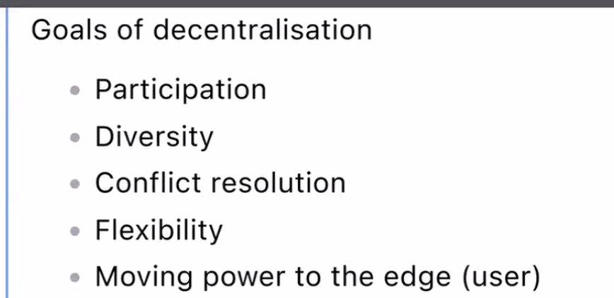


game theory -use economic incentive.. 


Imp = check the slide again what he said about this above pic.. 9:11AM. 

Data - little bit.


Imp - have chatGpt break down - Elliptic curves.

taking a point on curve and then take another point to guess something etc. .


diff algo work differently.

https://github.com/ExtropyIO/SolanaBootcamp


Slot- timestamps. Epochs.

Link before this - parent blockhash.

Child slot;;

Details of txns.


Block size is important factor.

IMP - what's BTC blocksize and WTH?


explorers:


TXns dont get picked up right away and are in pending state.

Ex BTC - 10 mins - mempool can get large. 

but ETH and SOL it ets complicated. MEV 

IMP - MEV - 

its public people know what Txns are happenning. Nodes can decide what to use based on that.

Block producers can extract more value. 

higher Txn fee they can pick.

lot of demand - large mempool.


Solana used improvements .. around scalability and speed. 

message works within Solana. 

Gossip protocol was unstructured way and unfocused. not geaographic proximity. etc .

mechanisms to improve on that. 

SOL - more targeted.

we know who the block produceer will be - so why dont we just send Txn to that person - then they can put in the block. Then they can pass it around. initially only producer needs it.

So main thing we know who wil be Leader (block producer).

This reduces load on the system. IMP - to make it more scalable etc


Deterministic Leader! IMP


QUestion - 

If we only send the txn to one single blockproducer, wouldn't that introduce a sense of centralisation? what if they don't include our txn?

Erick Fernandez

now

The rotating leader schedule reduces this risk by sending transactions to multiple validators


IMP - listen 925AM.


9:28 - concurrency.. listen again.


Txn 1 , 2 and 4 can be separated things out and run paraellel and then Txn 3.


IMP - gossip protocol - listen early and also research.


### Proof of History


There is no Clock available.

Block producer sequences Txns.

### Consensus 2 parts


random function used by some blockchains.

### liveness

if no producer is chosen? 

in BTC eventually someone will solve the puzzle.

If you assign slot - what is person chosen if offline or cant produce one? 
Then how do we proceed. part of the solution could be based on time slots.

Then next slot can produce the block.

So we need reliable source of time.


BFT is general name. 

Nakamotu consensus. 


crypto economic incentive to behave.


voting takes place among certain nodes - they dont scale very well. Since once you have lot of nodes it takes time. 

If some nodes dont vote.. some faults system has to proceed


Lesson 2 - 


there is no centralized auth for time.


hash - commit scheme that are binding. one way functions.


this has to be done sequentailly but we cna verify in parallel.


### homework


Question - 

Anonymous

15 minutes ago

Could you share a link to some resource on how solana manages to sync everything so quickly?

Erick Fernandez

13 minutes ago

Here's the Solana whitepaper: https://github.com/solana-labs/whitepaper/blob/master/solana-whitepaper-en.pdf


## Day 2 - Tuesday- 6/4/24 - Rust / Solana Command Line Tools


### Lesson2 Pdf - 


#### Article - IMP Complete later

https://medium.com/solana-labs/proof-of-history-a-clock-for-blockchain-cf47a61a9274

Published in Solana - 7 min read · Apr 19, 2018


Solana is the most performant permissionless blockchain in the world. On current iterations of the Solana Testnet, a network of 200 physically distinct nodes supports a sustained throughput of more than 50,000 transactions per second when running with GPUs. Achieving as such requires the implementation of several optimizations and new technologies, and the result is a breakthrough in network capacity that signals a new phase in blockchain development.


##### 8 key innovations 

There are 8 key innovations that make the Solana network possible:

- [**Proof of History (POH)**](https://medium.com/solana-labs/proof-of-history-a-clock-for-blockchain-cf47a61a9274) — a clock before consensus;
- [**Tower BFT** ](https://medium.com/solana-labs/tower-bft-solanas-high-performance-implementation-of-pbft-464725911e79)— a PoH-optimized version of PBFT;
- [**Turbine**](https://medium.com/solana-labs/turbine-solanas-block-propagation-protocol-solves-the-scalability-trilemma-2ddba46a51db) — a block propagation protocol;
- [**Gulf Stream**](https://medium.com/solana-labs/gulf-stream-solanas-mempool-less-transaction-forwarding-protocol-d342e72186ad) — Mempool-less transaction forwarding protocol;
- [**Sealevel** ](https://medium.com/solana-labs/sealevel-parallel-processing-thousands-of-smart-contracts-d814b378192)— Parallel smart contracts run-time;
- [**Pipelining**](https://solana.com/pipelining-in-solana-the-transaction-processing-unit/) — a Transaction Processing Unit for validation optimization
- [**Cloudbreak**](https://medium.com/solana-labs/cloudbreak-solanas-horizontally-scaled-state-architecture-9a86679dcbb1) — Horizontally-Scaled Accounts Database; and
- [**Replicators**](https://medium.com/solana-labs/replicators-solanas-solution-to-petabytes-of-blockchain-data-storage-ef79db053fa1) — Distributed ledger store


One of the most difficult problems in distributed systems is agreement on time. In fact, some [argue](https://grisha.org/blog/2018/01/23/explaining-proof-of-work/) that Bitcoin’s Proof of Work algorithm’s most *essential* feature is functioning as a decentralized clock for the system. At [Solana](https://solana.com/?utm_source=medium&utm_campaign=proof_of_history), we believe **Proof of History** provides this solution and we’ve built a blockchain based on it.

###### Google's Spanner

Decentralized networks have solved this problem with trusted, centralized timing solutions. For example, [Google’s Spanner ](https://static.googleusercontent.com/media/research.google.com/en//archive/spanner-osdi2012.pdf)uses synchronized atomic clocks between its data centers. Google’s engineers synchronize these clocks to a very high precision and constantly maintain them.


###### HashGraph

This problem is even harder in adversarial systems like blockchain. Nodes in the network can’t trust an external source of time or any timestamp that appears in a message. [Hashgraph](https://www.hederahashgraph.com/) for example, solves this problem with a “median” timestamp. Each message that is seen by the network is signed and timestamped by a supermajority of the network. The median timestamp for the message is what Hashgraph calls “fair” ordering. Each message has to travel to the supermajority of the nodes in the system, then after the message collects enough signatures, the entire set needs to be propagated to the entire network. As you can imagine, this is really *slow*.


What if you could simply trust the timestamp that is encoded into the message? An enormous wealth of distributed systems optimizations would suddenly be at your disposal. E.g.

> “Synchronized clocks are interesting because they can be used to improve the performance of distributed algorithms. They make it possible to replace communication with local computation.”
>
> —[ Liskov, B. Practical uses of synchronized clocks in distributed systems](http://www.dainf.cefetpr.br/~tacla/SDII/PracticalUseOfClocks.pdf)

In our case this means a high throughput, high performance blockchain


##### Proof of History

What if instead of trusting the timestamp you could prove that the message occured sometime before and after an event? When you take a photograph with the cover of New York Times, you are creating a proof that your photograph was taken after that newspaper was published, or you have some way to influence what New York Times publishes. With Proof of History, you can create a historical record that proves that an event has occurred at a specific moment in time.


The Proof of History is a high frequency [Verifiable Delay Function](https://www.youtube.com/watch?v=qUoagL7OZ1k). A Verifiable Delay Function requires a specific number of sequential steps to evaluate, yet produces a unique output that can be efficiently and publicly verified.

Our specific implementation uses a sequential pre-image resistant hash that runs over itself continuously with the previous output used as the next input. Periodically the count and the current output are recorded.

For a SHA256 hash function, this process is impossible to parallelize without a brute force attack using 2¹²⁸ cores.

We can then be certain that real time has passed between each counter as it was generated, and that the recorded order each counter is the same as it was in real time.


#### Rest of lesson 2


20:26


Lesson -2 - 🕉️🕉️🕉️🕉️


Solana.com collective - core teams 

18:22 - join talent later - to meet people , meetups etc super teams 

14:59 - community pages .. not all maybe up to date 


Good ChatGPT question - how is global time maintained by Solana 

6:58 - 2 article links 


2.35 - leader schedule generation algorithm- screenshot - use ChatGPT to understand 

Need to revisit lesson 1 - concept of time was introduced & that’s what makes Solana scalable. In the beginning 1:00 itself he says about last lesson. 


https://youtu.be/gDzjyPgtFEk?si=vl_nw24DmHY8VHVz


### Rust - 

21;37 - 

Diff to many other lang - 


memory safety. w/o affecting performance of run times. 

So far lang used gargave collection - we used to stop program and remove and make space avai;ble and code ran again. that can affect perf of code. but we do need something to remove something we no longer need in memory. 

We need to be careful to do in safe way. Dont remove too soon. We need to know lifetime.

Careful w concrurrency - 2 people trying to update same data, ... we dont want data races. 


that really informd design of Rust. 

They created rules as compilable checks. Follow some rules then memory gets handled correctrl.

More things checked by compilter since its addressing memory safety.

#### `mut` modifier


Types language.


it tried to figure type but gives error if it cannot.


compound more complex type


x.0 - access items.


#### vector


macro. 


heap - manage carefully.


we dont have to worry about stack as much as heap.


same type.

static in Rust.


cant delete or add item. Size has to be same.


Slice - window of an array. 


Rust does not let you do implicit type conversion - 


returns bool;

last stmt is bool; thats a return.

final stmt no semicolon needed.


#### loop 


#### option


#### Result

ok or error


#### <Option<T>

- None 
- some (value)


45:00


### 59:36 - wallet, key pair 


### 56:28 - Solana cli 


### 52:51 - rust playground 

### 52-12 - learning rust links 

### 50:00 - install Rust 

### 51:19 - cargo 


1:00:00 - Solana config command , airdrop , transfer 

### airdrop

### transfer


### memory - heap stack 

1:03:00 - memory - heap stack 


Old language you keep track of memory & remove when needed . 

### Dangling pointer

### In rust- Ownership 


### function passing argument

1:15:00 -- function passing argument loses ownership- check in ChatGPT IMP 


### references- shared & mutable 

1:19:00 - 2 types of references- shared & mutable 

**<u>Imp</u>** - read the lesson best 


## Day 3 - Wednesday- 6/5/24 - Rust / Solana development


### YouTube Link

https://youtu.be/ewfmlyA0E14?si=9Bp1PLbdlEfWoPrt


Lesson 3- 🕉️🕉️🕉️🕉️🕉️🕉️


### Vectors

17:40 - vectors 


### Generics

14:30 - Generics 

### Strings

5:00 strings 

### Trait

Trait; like interface in other languages. 


### Iterators

21:46 - Iterators


looks like next returns an Option. check later.

&1 - does not take ownership of it.


### Shadowing


### Resources


### Rust in Blockchain Newsletter

Subscribe to it IMP


Now we will move into Lesson 4

### Lesson 4 


### Lifetime Constraints on Referecences


Outer and inner scope.

this is problem.


Solution


### Slices


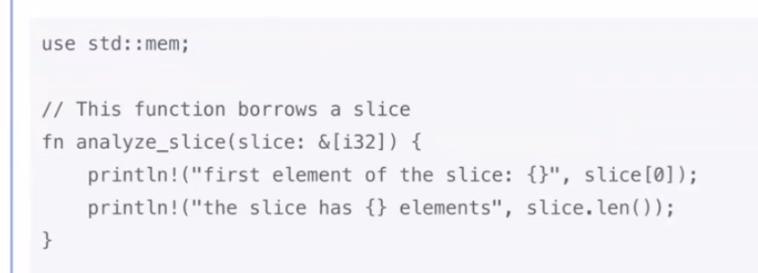


Similar to array gives more flexibility. Array is fixed in size.

32:05


### Arrays/Slices docs


### Printing / Outputting


#### names arguments


### Creating Project - crate


Number of crates together will form pkg.

#### library crate

#### binary crate

#### modules


### Macros


#### Exclamation mark !


see docs.


### HashMaps


store values by keys. 

Arrays store value by index.

has to implement 2 traits - `Eq` and `Hash`

growable.

capacity.

#### new method

#### example


#### insert()


#### iterator


#### get()


return option.


pass reference to team name.


unwrap handles none too.

check chatGpt on copied. 


### Pattern matching


### Ranges


### Variables in matching

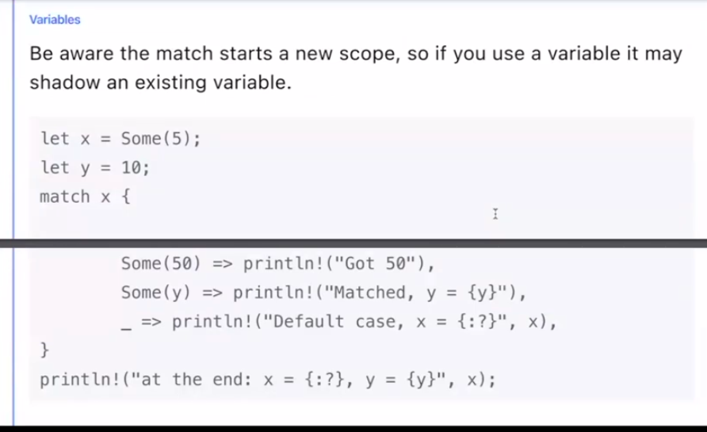


y gives inner scope - its not y = 10;


y in inner - is any varible. y will be set to 5. Since it matches any variable.


2nd print y is from outerscope.


### Destructuring


1st point - we match is y=0. but x is anything - any value. BUt since y  can only be 0 - It wont match Point.

2nd point - x=9 and y can be any value.  so will matchl 

3rd point - any values of x and y.


Point (1, ) - will match 3rd one only.


### Expressions in Matching


### Rust Errors

1:08:00 - rust errors 

### Recoverable / Unrecoverable errors

Recoverable & unrecoverable errors 

Result

### Propagate error back up

Propagate error back up the stack 

Screenshot file open 

### Shortcut to propagate

1:13;04 - shortcut 


### panic!

1:15:00 - unrecoverable error , panic! Macro 


### Trait

1.16.00 trait examples in Solana 


### Homework3 - Solana cli install

Home work 3 - installing Solana cli tools which he went over yday 

Homework3 kind of done- although the Airdrop did not work.

### write tests

1:06:00 write tests 

Cargo test 


## Day 4 - Thursday- 6/6/24 - Solana Development Contd.


Lesson 4 🕉️🕉️🕉️🕉️🕉️🕉️

Solana development 

3:13 - Solana Programs Overview 

Program is different than other chains. 

Programs are stateless. 

Interact with accounts that have state. 

Program itself is in account special kind. 

7:25 - parameters - screenshot 

8:13 - transactions 


### Dapp

9:10 Dapp architecture 


Dapp

10:24 - Dapp


### Configuration - Cargo.toml


### RPC


JSON link

IMP - Always check the PDF lessons files


Serialization - later chatGpt to understand more - IMP

See Docs - program details


### Programs and accounts

Program is also an account.

#### System program


#### Data account

program can own data account.


#### rent epoch 

pay for storage you have on solana


we will look at this later.

#### program


below


this loads a program.

IMP_ check later BPFLoader


#### program arguments


#### Progam ID


#### Accounts


##### Account types


##### 


#### Instruction Data


#### Generic Program flow


#### General Client Flow

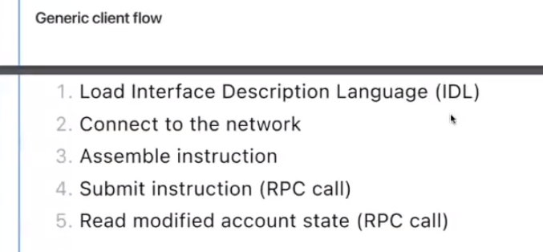


### Development Workflow


#### compilation


#### `cargo build-bpf`


#### Deployment


#### interaction


`solana program deploy <Path>`


### Programs / State / Data / Rent / Fees


### playground example


see the demo 

Simple project


simple program - isnstruction data is not there.

msg! - log some strings. to see whats happening.


we create iterator goes through the accounts. since multiple accts could be there.

we take first one.- nextaccountinfo

we check if acct is owned by this account. if not return error.


serialize.

### links


### Homework 4 


check balance, send lamports to team mates.

### Break solana game

submit lot of txns to network and see if you can break it.

highest score.


### Fizz buzz program - 

only rust

try to write in idiomatic way.

### Two Sum


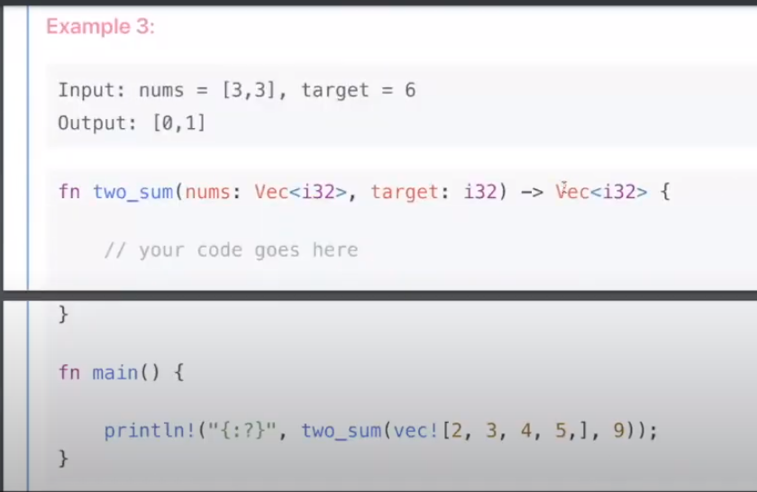


try to do it in idiomatic way.

### rust playground


## Day 5 - Monday- 6/10/24 - Solana Accounts and Development


### Solana Accounts and Development


extra topics poll -

- downtimes
- structuring best projects
- MEV
- auditing
- curve on pump fund?? 
- game apps
- tokens
- practical apps
- adv rust libraries
- oracles
- acct compression, 
- bridges
- security


answers - homework 1 - 


2) monopoly game
   1) players have some position on board, assets - keep track of that - state of system
   2) some consensus - about that state - however you do that. 
   3) cheat - 
   4) dice being correctly - some VRF 
3) CBDC - central bank dont want to give up control. technological side they can be useful but not otherwise.


### Lesson 5 - PDF


5:20 - Lesson 5 

### Solana accounts 


### account fields

6:19’- account fields 


### owner vs holder 

7.17 - owner vs holder 


### account type 

14.03 - account type screenshot 


5. upload is done in pieces. FYI. 


### Programming model


https://docs.solana.com/developing/programming-model/overview


### Sealevel - parallel processing of smart contracts


https://medium.com/solana-labs/sealevel-parallel-processing-thousands-of-smart-contracts-d814b378192


ahead of time accounts are known which are read and write.

sort by that.

non-overlapping ones are scheduled in parallel. done safely.

Now used in other chains.

Even Ethereum in baby steps.


### Transaction Structure


### Msg Macro

see above screenshot


https://docs.rs/solana-program/latest/solana_program/macro.msg.html


### Breaking program into modules


#### crate


mod keyword


Some of it has to come serialized, deseriaized etc.


main business logic in processor module.

Some of the data that arrives have to serialized you need to have instructions hwo to deserialized.

State acct. once you made update you need to serilizr the update. 

Anchor lot of those will be taken care for you.

programs not written in anchor you need to understand that too.


### Solana Playground


With + you can create project.


has tests as well.


### Python too!


### local network


also CLI to connect to testnet or devnet.


### Lesson 6


array of accounts is passed.


next storage


### Rust topics

#### `lifetime`


compiler checks the lifetime.


r uses x as reference inner {}

but outside r is not valid. 

We will get error.

#### borrow checker


now &str being returned by function has difficulty since it can be either x or y.

so we need to give more details and explicit.


#### lifetime annotation `'`'


we are calling a lifetime `'a` - we are saying inputs to our function will have same lifetime.

this helps the compiler to do its checking.


### DeFi Introduction


Remittance much bigger prospect in fiat world.


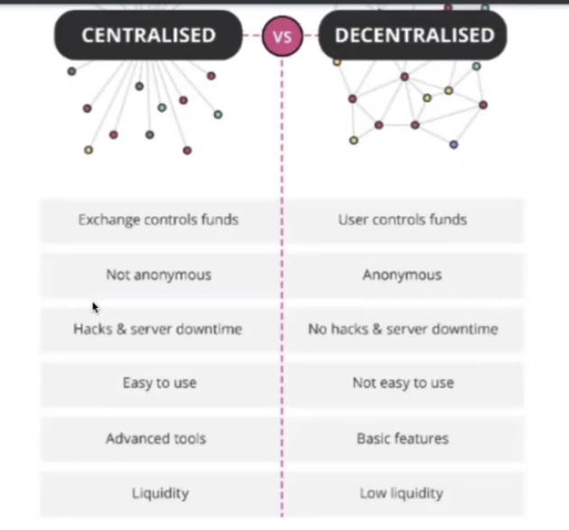


Not complete Anonimity in Crypto. But in centralized exchange you are exposed.


Token being listed on exchange is expensive to have them list. But DeX you can easily.

Early exchanges had a problem. you had to wait for someone to come in and buy etc. like how you have buy and sell sides. Early designs were problemtic.

But Uniswap came in and funded by ETH - AMM - automatic market maker.


### AMM and liquidity pools 


share of fees for liquidity pool.


#### Constant Functions


LP Tokens


https://medium.com/codex/an-introduction-to-automated-market-making-994bc76c61f4


#### Price Impact / Slippage / Impermanent Loss


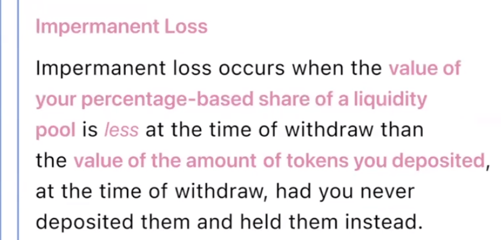


### Composability


https://medium.com/monolith/understanding-defi-composability-explained-70f93d9c0f01


ERC-20 have standards  - so composibility is possible.

Solaba uses PDA in that regard.

#### Risks associated with composability


### Borrowing / Lending

Compound


### Yield Farming


Yield Farming at its simplest is a means of
earning rewards for depositing tokens
Users are rewarded for providing liquidity
Different strategies are used by investors to
maximise their rewards from the many DeFi
projectsCompound and yearn.finance introduced this
area to DeFi
June 2020 BAT token


### Flash Loans

An innovative financial product
Does a risk free loan with no collateral required,
of virtually any value , with an extremely low fee
(say 0.09 %) seem to good to be true ?
Imagine that line 2 in this contract increases the
account balance by 5

We dont see this in Traditional finance. Reason is txns are atomic. 


#### Problems w Flashloan

since you can borrow a lot you can do an attack for price movement. 


### Major projects on Solana


#### Liquid Staking

Jito;

your tokens can get locked. But this lets you use those token.


#### Raydium - DeX


#### sophisticated Swaps

DeX swapping is quite sophisticated.

Here SOL-USDC-ORCA


One aspect of DeFi is NFT.

### NFT

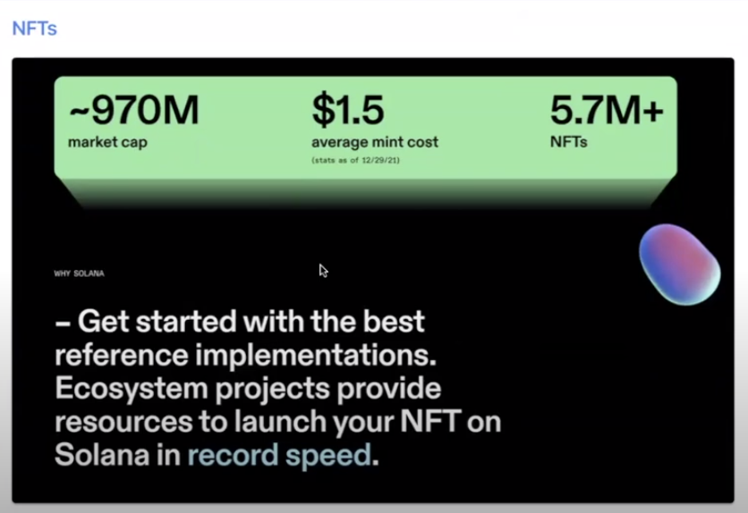


Nature of use is changing. Initially - tokening digital assets, artworks.

Using in Games or access to systems. Role of NFTs have changed - focus point of view.


We will look at NFT projects such as Metaplex in
later lessons.


### Tokens on Solana

#### Token Program

See Docs

https://spl.solana.com/token

The token program is part of the solana program library which is is a collection of on-
chain programs targeting the Sealevel parallel runtime , covering a number of areas such as

- tokens
- governance
- name service
- token swaps
- lending

The Solana token program is heavily used, its
program id is
: TokenkegQfeZyiNwAJbNbGKPFXCWuBvf9Ss6
23VQ5DA
The program is used to create tokens with functionality similar to the ERC20 and ERC721
(NFT) standards.


https://github.com/solana-labs/solana-program-library


https://medium.com/solana-labs/sealevel-parallel-processing-thousands-of-smart-contracts-d814b378192


https://explorer.solana.com/address/TokenkegQfeZyiNwAJbNbGKPFXCWuBvf9Ss623VQ5DA


### ETH vs SOL differences on Tokens


### Understanding the Accounts involved

See these articles
article 1 - https://medium.com/@jorge.londono_31005/understanding-solanas-mint-account-and-token-accounts-546c0590e8e
article 2 - https://medium.com/coinmonks/solana-programs-part-1-understanding-spl-token-mint-fabd13323219


IMP - read the above articles

#### Token program

#### Token mint account

#### Token account


Token program - part of library - that provides code to implement token.

2 accounts involved. Token mint account and Token account.

Each user has their own Token Acccount to shows balance for that token owner. Only 1 Token mint account.


### Homework 5


IMP - do the exercises. Day 6 beginning gives some explanation how to work the exercises.

rustlings exercises.


## Day 6 - Tuesday- 6/11/24 - Rust / DeFi


Homework 5 small explanation.

Also homework 3 & 4 answers are discussed - till 13:50;

### Tokens

now start from Tokens again.


token program supplied by solana.

We need to create Token Mint Account.

Then you need token account for that owner.

1 token mint account per token.


### The process of creating a token

When we create a token we need to create a token mint account which contains details about
the token and who can do administrative functions.
This doesn't hold user's balances, those are held in the token account.
Any user who desires to hold any given token, needs a token account for the corresponding
token.
The overall process is

1. Create token
2. Mint tokens to an account
3. Transfer tokens to other users

Behind the scenes these are running various
functions.
For example when minting the tokens
We first call InitializeMint
This takes some parameters that are stored in a struct

#### `InitializeMint`

```bash
pub struct Mint {
/// Optional authority used to mint new
tokens. The mint authority may only be
provided during mint creation. If no mint
authority is present then the mint has a
fixed supply and no further tokens may be
minted.
pub mint_authority: COption<Pubkey>,
/// Total supply of tokens.
pub supply: u64,
/// Number of base 10 digits to the right
of the decimal place.
pub decimals: u8,
/// Is `true` if this structure has been
initialized
pub is_initialized: bool,
/// Optional authority to freeze token
accounts.
pub freeze_authority: COption<Pubkey>,
}
```


#### `InitializeAccount`

his then calls `InitializeAccount` which sets up the account struct

```bash
pub struct Account {
/// The mint associated with this account
pub mint: Pubkey,
/// The owner of this account.
pub owner: Pubkey,
/// The amount of tokens this account
holds.
pub amount: u64,
/// If `delegate` is `Some` then
`delegated_amount` represents
/// the amount authorized by the delegate
pub delegate: COption<Pubkey>,
/// The account's state
pub state: AccountState,
/// If is_native.is_some, this is a native
token, and the value logs the rent-exempt
reserve. An
/// Account is required to be rent-exempt,
so the value is used by the Processor to
ensure that
/// wrapped SOL accounts do not drop below
this threshold.
pub is_native: COption<u64>,
/// The amount delegated
pub delegated_amount: u64,/// Optional authority to close the
account.
pub close_authority: COption<Pubkey>,
}
```

this will reference the `mint` account. thats the `pub mint: Pubkey`


#### `MintTo`

Next the MintTo instruction is called, taking

- Public key of the mint
- Address of the token account to mint to
- The mint authority
- Amount to mint
- Signing accounts if authority is a multisig
- SPL Token program account

This will mint tokens to the destination account


#### Transfer

To transfer tokens we invoke the function process_transfer this transfers a
certain amount of token from a source account to a destination account:
We pass in the source and destination accounts and the amount.

The program will check that
1. Neither source account nor destination account is frozen

2. The source account’s mint and destination account’s mint are the same

3. The transferred amount is no more than source account’s token amount

  

Note the source and destination can be the same.

#### BURN

Burn is the opposite of Mint and removes tokens, from the supply and the given account.

#### Approve

This allows transfer of a certain amount by a delegate.

- Only one delegate is possible per account / token.
- A new approval will overrride the previous one.


#### Revoke

Removes the approval

#### Freeze / Thaw Account

This will freeze / unfreeze the account preventing / allowing transfers / mints to it.


26.07 _ token22 program 


28.00 Associated token account program 

31.17 - good link that shows 

32.26 - use cli to create tokens - do all this from lesson doc 

Go over all this and create them etc..


###  lesson 7

41:49 - lesson 7


### Further aspects of Solana Programs

### Compute Budget

https://solana.com/docs/core/fees#compute-budget


To prevent a program from abusing computation resources, each instruction in a transaction is
given a compute budget. The budget consists of computation units that are consumed as the program performs various operations and **<u>bounds that the program may not exceed</u>**. When the program **<u>consumes its entire budget or exceeds a bound, then the runtime halts the program and returns an error.</u>**
The following operations incur a compute cost:

- Executing BPF instructions
- Calling system calls
  - logging
  - creating program addresses

Each transaction roughly has the fixed cost and it naturally **<u>puts pressure on developers to optimize on-chain code to fit within the system limits.</u>** Transactions do have fees on Solana, though.


You may come across :

```
Program
GJqD99MTrSmQLN753x5ynkHdVGPrRGp35WqNnkXL3j
1C consumed 200000 of 200000 compute units
Program
GJqD99MTrSmQLN753x5ynkHdVGPrRGp35WqNnkXL3j
1C BPF VM error: exceeded maximum number
of instructions allowed (193200)
```


Currently for **<u>both mainnet and testnet</u>** , the l**<u>imit of computation units is 200K</u>** ， f<u>or log it is 100.</u>
You may also see:

```
Program log: Error: memory allocation
failed, out of memory
```


It means that you run out of memory, the limit for the stack is 4kb and 32kb for the heap.
You should be really careful when you use structures that can potentially use a large amount of heap, such as Vec or Box. When coding for the blockchain you need to pay more attention to memory than in traditional technology.
PS: Pay attention to **<u>recursive functions calls, the depth should not exceed 20</u>**.


#### Logging the compute budget from Rust

Use the system 

#### sol_log_compute_units()   - 

IMP - good one to put in your code

call sol_log_compute_units() to log a message containing the remaining number of compute
units the program may consume before execution is halted


### Breaking program into modules

Modules give code structure by introducing a hierarchy similar to the file tree. Each module has a different purpose, and functionality can be restricted. 

At the root module multiple modules are compiled into a unit called a crate. Crate is synonymous with a ‘library’ or ‘package’ in other languages.
Modules are defined using the mod keyword and often contained in lib.rs .
A Common pattern seen throughout program implementations is:


```rust
// lib.rs
pub mod entrypoint;
pub mod error;
pub mod instruction;
pub mod processor;
pub mod state;
```

Where:

- lib.rs : registering modules
- entrypoint.rs : entrypoint of the program
- instruction.rs : (de)serialisation of instruction data
- processor.rs : program logic
- state.rs : (de)serialisation of accounts state
- error.rs : program specific err


### Program derived addresses

See article - https://www.brianfriel.xyz/understanding-program-derived-addresses/


See PDA overview article - https://www.alchemy.com/overviews/program-derived-address


See wiki - https://solana.wiki/zh-cn/docs/account-model/


#### Solana design constraints:

- All state has to be fed to the program
- A program can only alter the state of the accounts that it owns


Program can modify any account that it owns, it just can't sign for it.

 

Program derived accounts enable programs to create accounts that the program can sign for.
Being able to sign means you can open as well as to close an account.


#### Account Signing Authority

1. Solana accounts can only be assigned to a program if the **<u>account’s signing authority approves the change.</u>** Typically, the signing authority just means that the corresponding private key must sign the transaction.
2. Since program execution state is entirely public and known to every validator, there’s no way for it to secretly sign a message to create an account. To allow account creation by programs, the Sealevel runtime provides a syscall which allows a program to derive an address from its own address which the program can freely claim to sign.


Program Derived Addresses (PDAs) designed to be controlled by a specific program. With PDAs,

programs can programmatically sign for certain addresses without needing a private key. PDAs

serve as the foundation for Cross-Program Invocation (https://docs.solana.com/developing/programming-model/calling-between-programs#cross-program-invocations) , which allows Solana apps to be

composable with one another.

- PDAs are 32 byte strings that look like public keys, but don’t have corresponding private keys 
- `findProgramAddress` will deterministically derive a PDA from a programId and seeds
  (collection of bytes)
- A bump (one byte) is used to push a
  potential PDA off the ed25519 elliptic curve
- Programs can sign for their PDAs by providing the seeds and bump to `invoke_signed` (https://docs.solana.com/developing/programming-model/calling-between-programs#program-signed-accounts)
- A PDA can only be signed by the program from which it was derived 
- In addition to allowing for programs to sign for different instructions, PDAs also providea hashmap-like interface for indexing accounts


https://docs.solana.com/developing/programming-model/calling-between-programs#cross-program-invocations


https://docs.solana.com/developing/programming-model/calling-between-programs#program-signed-accounts


### Example use case

Using a program derived address, a program may be given the authority over an account and later transfer that authority to another. This is possible because the program can act as the signer in the transaction that gives authority.
For example, if two users want to make a wager on the outcome of a game in Solana, they must each transfer their wager's assets to some intermediary that will honour their agreement.
Currently, there is no way to implement this intermediary as a program in Solana because
the intermediary program cannot transfer the assets to the winner.
This capability is necessary for many DeFi applications since they require assets to be transferred to an escrow agent until some event occurs that determines the new owner.

- Decentralised Exchanges that transfer assets between matching bid and ask orders.
- Auctions that transfer assets to the winner.

- Games or prediction markets that collect and redistribute prizes to the winners.


Program derived address:
1. Allow programs to control specific addresses, called program addresses, in such a way that no external user can generate valid transactions with signatures for those addresses.
2. Allow programs to programmatically sign for program addresses that are present in
    instructions invoked via Cross-Program Invocations (https://docs.solana.com/developing/programming-model/calling-between-programs#cross-program-invocations).


Given the two conditions, users can securely transfer or assign the authority of on-chain assets to program addresses, and the program can then assign that authority elsewhere at its discretion.


### PDA derivation details

Program derived addresses are deterministically derived from a **<u>collection of seeds and a program id</u>** using a 256-bit pre-image resistant **<u>hash function</u>**.
The **<u>p</u>**<u>**rogram address must not lie on the ed25519 curve to ensure there is no associated private key**</u>.
During generation an error will be returned if the address is found to lie on the curve. There is about a 50/50 chance of this happening for a given collection.


a bump is done so no private can be found.

Derivation pseudo code:

```rust
pda_pubkey =
findProgramDerivedAddress(programId, seeds, seedBump)
```


For Sealevel to parallelise batches of instructions and to prevent concurrency issues the client needs to provide an account in the list of accounts to be used by the program even if that account doesn't exist yet.
As an account is being created it will need to have some lamports transferred to it to become
rent exempt. Depositing lamports will require this account to have its state modified and as such it needs to be marked as writable.
*This means that PDA has to be derived by the client and has to be submitted to the program*.

client needs details if PDA to be found.--- so pda has to be derived by the client and submit to program.


### Practical Instructions for upcoming homeworks

#### Prerequisites

The examples require the following items to work:

- Rust compiler / Cargo manager
- Solana client
- Solana work repo


#### Cloning the example repo


```bash
git clone https://github.com/ExtropyIO/SolanaBootcamp
```

If you prefer you can use gitpod (https://gitpod.io/#https://github.com/ExtropyIO/SolanaBootcamp) or a codespace


#### examples_baremetal

solana program we will write.


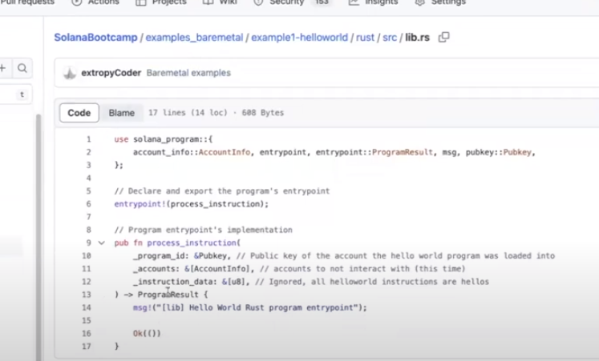

there is more complex ones too for you to do.

when we cover anchor we will move on to Anchor examples.


#### Set-up for development

#### Windows

Local development set-up requires a terminal
instance for:

- Local cluster
- Cluster logs

It is quite easy to set this up within a single VS code session as such:

1 terminal local cluster, 2nd cluster logs


### Starting a local cluster

To start a local validator run

```bash
solana-test-validator .
```


Doing so will create an output of the following format:

```bash
--faucet-sol argument ignored, ledger
already exists
Ledger location: test-ledger
Log: test-ledger/validator.log
⠋ Initializing...
Identity:
3qrx65hH5NmogVYrYMaNA93BjJVuWDH39qJTkT8HzM
49
Genesis Hash:
BniBn8Fzv6TYe59g4yR1ie6XsjLUvxfkPz9EX8YQfX
gY
Version: 1.9.17
Shred Version: 21208
Gossip Address: 127.0.0.1:1024
TPU Address: 127.0.0.1:1027
JSON RPC URL: http://127.0.0.1:8899
⠖ 00:00:37 | Processed Slot: 321619 |
Confirmed Slot: 321619 | Finalized Slot: 3
```

From this we can see that local RPC server is listening on port 8899 on the local network. Requests from client will be to that IP and that URL.

### Setting the right network

To check the network that the client will connect to run

```bash
solana config get .
```

The following settings will be output:

```bash
Config File:
<USER>/.config/solana/cli/config.yml
RPC URL: https://api.devnet.solana.com
WebSocket URL:
wss://api.devnet.solana.com/ (computed)
Keypair Path:
<USER>/.config/solana/id.json
Commitment: confirmed
```


On the second line it is displayed that the client will connect to the devnet.

### Running

```bash
solana config set --url http://localhost:8899
```

will set the default network to localhost.


Running - solana config get again gives:

```bash
Config File:
/Users/chavka/.config/solana/cli/config.ym
l
RPC URL: http://localhost:8899
WebSocket URL: ws://localhost:8900/
(computed)
Keypair Path:
/Users/chavka/.config/solana/id.json
Commitment: confirmed
```


With that set, tests will know which cluster to
connect to in order to interact with our program.

#### Open cluster logs

In the second terminal window run

```bash
solana logs
```

This window will display information from the cluster such as logs relating to:

- deployment

- execution costs
- cross program invocations
- custom logs

Messages are communicated from the program using the msg! macro.

#### Getting enough balance

The balance for a given account can be retrieved with

```bash
solana balance
```

To top up your wallet (the one who's private key is referenced here `Keypair Path: <USER>/.config/solana/id.json`


```bash
solana airdrop <SOL_AMOUNT>
```

This doesn't always work as expected, especially on devnet and the chance of succesful airdrop is higher with SOL balances being no more than two, so run

```bash
solana airdrop 2 
```


Tests can be written in such way to automatically airdrop SOL to the accounts that will require them.

### Repo overview

The purpose of the repo is to provide examples which work right out of the box and allow any potential developer to immerse themselves in the Solana development envrioment by exposure to tools as well as examples of programs, tests and clients.
Each example in the examples_baremetal directory has:

- rust code that will be deployed to the cluster in the /rust directory
- typescript code that will interact with on-chain program in the /client directory


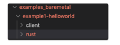


Additionaly in the main root there is a file called `utils.ts` which has wrappers for frequently
reused functions such as `establishConnection()` or `loadKeypair()` .
Baremetal in this instance refers to interaction with the hardware without applications or an operating system at a very low level.


This is in contrast to Anchor (which we will cover later) that abstracts away quite a lot of the tedious boilerplate code and in process greatly enhances development speed.
Commands for these examples are contained in the `package.json` file at the repo root directory.

### Compilation

Examples provided can be compiled with`npm run build `which will compile all of the programs at once.
Under the hood it will invoke modified `cargo build-bpf` , `cargo build-bpf --workspace
--manifest- path=./examples_baremetal/Cargo.toml`
which will build binaries for all the examples in the baremetal directory.


### Deployment

In the example directory to deploy a given program command run

```bash
npm run deploy:X
```

where X is the number of the example program to deploy.

This has to be done from within the same directory where package.json is.

### Interaction

To go along with the example programs there are short, clear and well documented clients
written in typescript that allow connection to the pre-deployed contracts.
To run a client run

```bash
npm run call:X
```

where X is the number of the example program to interact with.
This has to be done from within the same directory where package.json is.


### Client functions

In essence each client executes the following steps upon each invocation:

1. Load libraries
2. Load binary
3. Load binary keypair
4. Load payer keypair
5. Establish connection to the cluster (specified in client config) 
6. Build serialised representation of arguments and function to invoke
7. Call the program
8. Read modified on-chain state
9. Log cost of interacting with the program


Additional checks exist such as those that check whether caller has enough SOL or whether program in question has been deployed. These not being satisfied will log a omment which will allow the user to fix the problem.

For the examples in the repo
See repo - https://github.com/ExtropyIO/SolanaBootcamp
In the project root run

```
npm i
```

Example 1
1. Compile
    npm run build
2. Deploy
    npm run deploy:1
3. Interact
    npm run call: 1


This program receives no instruction data, no accounts and it only logs a message using the msg! macro that can be viewed in the window running solana logs.


Extra Links:
Solana Cookbook - Accounts - https://solanacookbook.com/core-concepts/accounts.html#facts
Solana Docs - Accounts - https://docs.solana.com/developing/programming-model/accounts
Solana Wiki - Account model - https://solana.wiki/zh-cn/docs/account-model/
QuickNode Article -- Solana Account Model - https://www.quicknode.com/guides/solana-development/getting-started/an-introduction-to-the-solana-account-model


### homowork 6 - going over


get a good understanding of Rust. Coz you need to know to write Solana.


extra coding challenge.


## Day 7 - Wednesday- 6/12/24 - Solana devl contd.


we are ahead 

### Lesson 8


### Today's topics

Authority and Ownership
Upgrading Programs
Program Flow
PDAs in practice


### Authority vs Ownership

#### Ownership

This ownership doesn't refer to Rust ownership, but rather it is an internal relationship between Solana's accounts.
On Solana only the owner can modify the state. Cloudbreak, Solana's account database maintains mapping between public keys and accounts which they own.
The System Program assigns ownership and initialises account data.
This is what this check does. It looks up in Cloudbreak whether its account address maps to the one of the provided addresses:


##### Cloudbreak

account database.

This does not mean that the program necessarily would modify an account. Additional checks are applied to ensure client requests are valid.


#### Authority

User space access control can be implemented by checking provided signatures against additional filters.
A Public key (or a group of them) can specified in the account to hold additional privileges. These keys with extended functionality are referred to as the authority, admin, manager and sometimes confusingly as owner. Multi signatures as well as layered and finely grained access can likewise be achieved


An account number that stores a u64 value can check whether the signature of the caller matches the one on the provided account.

```
struct Number{
    authority: Pubkey
    value: u64
}
```


In code the check could be implemented thus:

```rust
...
let accounts_iter = &mut accounts.iter();
let number_account = next_account_info(accounts_iter)?;
if caller.is_signer && *caller.key == number_account.authority{
number.value = new_value; // modify state
}
```


Interestingly if the account is a PDA and is to have only a single account as the authority, an alternative verification scheme can be employed.
In the program, the PDA can be re derived from the callers public key to see if it matches the account provided.
A simplified account would look like this:

```rust
struct Number{
	value: u64
}
```


Whilst in the program logic:

```rust
...
let accounts_iter = &mut accounts.iter();
let number_account = next_account_info(accounts_iter)?;
let number_pda = Pubkey::create_with_seed(
caller.key,
&seed,
&program_id)
.unwrap();
if caller.is_signer && *number_account.key == number_pda{
	number.value = new_value; // modify state
}
...
```


This tradeoff would result in lower cost per account but a slightly higher cost of computation

### Upgrading programs

#### Upgrading Solana Programs

By default Solana programs can be modified and upgraded, in the Solana playground see the upgrade button once you have deployed your program.
This is achieved by the BPF loader which is the owner of every upgradable Solana program account.
There is a maximum limit to the size of the code.
Upgradability on blockchains is a means to do rug pulls, you should be cautious when taking this approach.
For more details see this article - https://jstarry.notion.site/Program-deploys-29780c48794c47308d5f138074dd9838


The Upgradeable BPF loader program supports three different types of state accounts:


1. Program account: This is the main account of an on-chain program and its address is commonly referred to as a "program id." Program id's are what transaction instructions reference in order to invoke a program. Program accounts are immutable once deployed so you can think of them as a proxy account to the byte- code and state stored in other accounts.
2. Program data account: This account is what stores the executable byte-code of an on-chain program. When a program is upgraded, this account's data is updated with new byte-code. In addition to byte-code, program data accounts are also responsible for storing the slot when it was last modified and the address of the sole account authorised to modify the account (this address can be cleared to make a program immutable).
3. Buffer accounts: These accounts temporarily store byte-code while a program is being actively deployed through a series of transactions. They also each store the address of the sole account which is authorised to do writes.


### Using the Solana CLI

We use the standard deploy command to re deploy.

```bash
solana program deploy <PROGRAM_FILEPATH>
```


By default, programs are deployed to accounts that are twice the size of the original deployment. Doing so leaves room for program growth in future redeployments.
But, if the initially deployed program is very small and then later grows substantially, the redeployment may fail.
To avoid this, specify a `max_len` that is at least the size (in bytes) that the program is expected to become .

```bash
solana program deploy --max-len 200000 <PROGRAM_FILEPATH>
```


### Program Flow

The usual flow from receiving the instruction to reporting `Ok(())` .

1. Program entry
2. Extracting instruction
3. Access checks
4. State change


Most of the high level logic happens in the `processor.rs` .
Here is an example of how a call to mint token amount would get handled on the SPL token program. source code (https://github.com/solana-labs/solana-program-library/tree/master/token)

#### Program entry

All the parameters (accounts, instruction data, signatures) for this program call are passed to the entry point.
The processor is where the main logic occurs, though much of it is implemented in other modules.


It is called immediately after the program is invoked.


The first thing the processor does is unpacking the instruction and matching it against associated function. On line 841 of `processor.rs` is the function `process` :

#### Processor

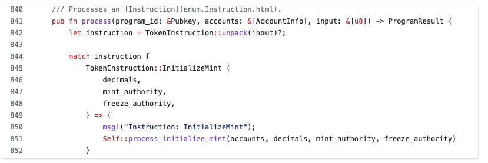

Instructions passed are pulled out with unpack.

Then you are matching that instruction with initialize mint.


#### Extracting instruction

In file `instruction.rs` at line 22 is the start of the struct describing all of the possible instructions that implement SPL token functionality.


And at line 174 `MintTo` is described.


Based on the unpacking of the instruction, data processor knows which function to call.


so if we match against Initialize mint we do that, if we match mintTo then we do that.


#### Access Checks


#### State Change


### Homework - 7 

carry on with Rustlings set of homework.


## Day 8 - Thursday- 6/13/24 - PDAs in practice


### PDAs in practice

#### PDA creation process


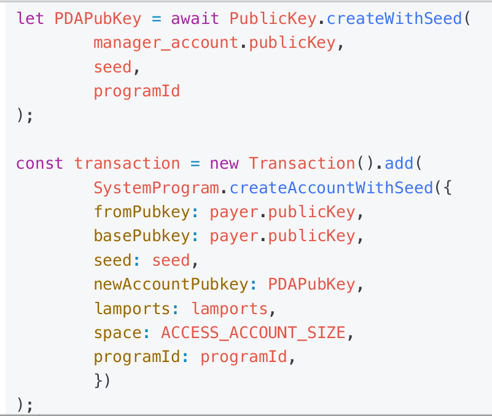


### 

### Seed selection

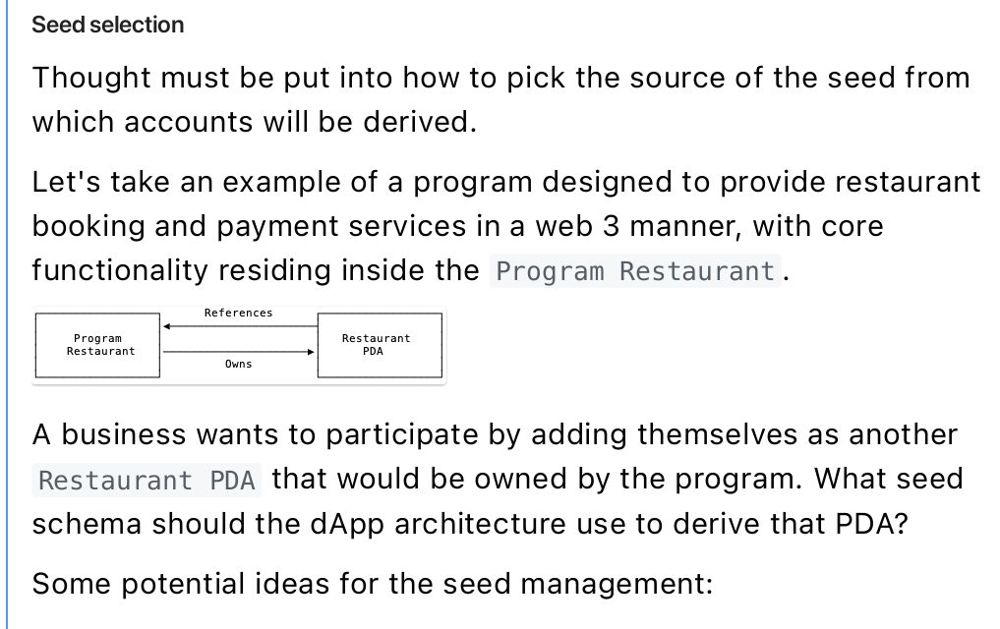


### State Chain


### Seed schema correctness


# MyHomeWorks


## Git Repo 


/home/chakravarti/GitHubRepos/SOLANA/SolanaBootcamp

https://github.com/ExtropyIO/SolanaBootcamp

do the installs etc.

### Lesson PDFs

for reference - 

/home/chakravarti/GitHubRepos/solanaBC/Lessons


### Home work 5

#### Run - 

```bash
rustlings homework 5
```


#### `let x: i32`


#### [Shadowing](https://doc.rust-lang.org/book/ch03-01-variables-and-mutability.html#shadowing)


The other difference between `mut` and shadowing is that because we’re effectively creating a new variable when we use the `let` keyword again, we can change the type of the value but reuse the same name. For example, say our program asks a user to show how many spaces they want between some text by inputting space characters, and then we want to store that input as a number:

```rust
    let spaces = "   ";
    let spaces = spaces.len();
```

The first `spaces` variable is a string type and the second `spaces` variable is a number type. Shadowing thus spares us from having to come up with different names, such as `spaces_str` and `spaces_num`; instead, we can reuse the simpler `spaces` name. However, if we try to use `mut` for this, as shown here, we’ll get a compile-time error:


#### String &str

can i do let s: str = "Hello, world"; ?


ChatGPT

No, you cannot directly declare a variable with the type `str` in Rust. Instead, you need to use either `&str` for string slices or `String` for owned strings. Here’s why:

Explanation

- String Slices (`&str`)

  :

  - String slices are always references, and they represent a view into a string.
  - You must always use `&str` to declare a string slice.

- Owned Strings (`String`)

  :

  - `String` is an owned, growable string type allocated on the heap.


```bash
fn main() {
    let s: &str = "Hello, world";
    println!("{}", s);
}


or 

fn main() {
    let s: String = "Hello, world".to_string();
    println!("{}", s);
}

see examples - 
/home/chakravarti/GitHubRepos/solanaBC/Rust/lessons/practice/strings2.rs
/home/chakravarti/GitHubRepos/SOLANA/SolanaBootcamp/homeworks_rust/homeworks/homework5/strings/strings2.rs


```


#### **Vectors in Rust**:

- Vectors are dynamically sized arrays, which means they can grow or shrink in size.
- Vectors store their elements contiguously in memory, which allows for efficient indexing and iteration.

**String Slices**:

- String slices (`&str`) are references to portions of string data.
- They are immutable, meaning you cannot change the data they point to.

**Macros**:

- Macros in Rust are powerful tools that generate code. The `vec!` macro simplifies the creation of vectors by allowing you to list the elements directly.


#### Iterator / next()

**Create a Vector**:

- `let my_fav_fruits = vec!["banana", "custard apple", "avocado", "peach", "raspberry"];`
- A vector of string slices (`&str`) is created.

**Create an Iterator**:

- `let mut fruit_iter = my_fav_fruits.iter();`
- An iterator is created for the vector using the `iter()` method. This creates an immutable iterator that borrows each element of the vector.

**Use the `next()` Method**:

- The `next()` method is called on the iterator to retrieve elements one at a time.
- `next()` returns an `Option` type: `Some(element)` if there is an element, or `None` if the iterator is exhausted.


### Home work 6 

#### Run - 

```bash
rustlings homework 6

from the homework_rust directory
```


#### Function parameter


**Immutable by Default**: Function parameters in Rust are immutable by default.

**Mutable Binding**: To modify a parameter, create a mutable binding within the function using `let mut`.

**Shadowing**: The `let mut vec = vec;` line shadows the original parameter with a mutable version, allowing modifications.


When you make `vec0` mutable and pass it as a parameter to a function, whether it remains mutable inside the function depends on how you pass it. In Rust, parameters can be passed by value, by reference, or by mutable reference. Each of these passing methods has different implications for mutability within the function.

##### Passing by Value

When you pass a mutable variable by value, the function takes ownership of the variable, and the original variable can no longer be used after the function call.

**Example:**

```
rustCopy codefn main() {
    let mut vec0 = Vec::new();
    fill_vec_by_value(vec0); // Ownership is moved to the function
    // vec0.push(1); // This will cause a compile-time error because vec0 is no longer valid
}

fn fill_vec_by_value(mut vec: Vec<i32>) {
    vec.push(22);
    vec.push(44);
    vec.push(66);
    println!("{:?}", vec); // [22, 44, 66]
}
```

##### Passing by Reference

When you pass a variable by reference, the function borrows the variable, but it cannot modify the original variable unless it is passed as a mutable reference.

**Example:**

```
rustCopy codefn main() {
    let mut vec0 = Vec::new();
    fill_vec_by_reference(&vec0); // Borrowing the vector immutably
    // vec0.push(1); // This is allowed because vec0 is still valid
}

fn fill_vec_by_reference(vec: &Vec<i32>) {
    // vec.push(22); // This will cause a compile-time error because vec is immutable
    println!("{:?}", vec); // []
}
```

##### Passing by Mutable Reference

When you pass a mutable variable by mutable reference, the function can modify the original variable.

**Example**:

```
rustCopy codefn main() {
    let mut vec0 = Vec::new();
    fill_vec_by_mutable_reference(&mut vec0); // Borrowing the vector mutably
    vec0.push(88); // This is allowed because vec0 is still valid and can be modified
    println!("{:?}", vec0); // [22, 44, 66, 88]
}

fn fill_vec_by_mutable_reference(vec: &mut Vec<i32>) {
    vec.push(22);
    vec.push(44);
    vec.push(66);
    println!("{:?}", vec); // [22, 44, 66]
}
```

##### Summary

- **Passing by Value**: Transfers ownership to the function. The original variable is no longer valid after the function call.
- **Passing by Reference**: Borrows the variable immutably. The function cannot modify the original variable.
- **Passing by Mutable Reference**: Borrows the variable mutably. The function can modify the original variable.

By understanding these different ways of passing parameters, you can control how variables are used and modified within functions in Rust.


##### Another example Function mutabiblity


```rust
// /home/chakravarti/GitHubRepos/solanaBC/Rust/lessons/practice/Homework6/move_semantics2.rs


fn main() {
    let vec0 = Vec::new();

    let mut vec1 = fill_vec(&vec0);   // here i am passing by Reference so not losing ownership

    // Do not change the following line!
    println!("{} has length {} content `{:?}`", "vec0", vec0.len(), vec0);

    vec1.push(88);

    println!("{} has length {} content `{:?}`", "vec1", vec1.len(), vec1);
}

fn fill_vec(vec: &Vec<i32>) -> Vec<i32> {
    let mut vec :Vec<i32> = vec.to_vec();

    vec.push(22);
    vec.push(44);
    vec.push(66);

    vec
}

```


let mut vec1 = fill_vec(&vec0);

i think i am returning a mutable vec so when i assigned the returned value to vec1 why i need to say its mut again?


ChatGPT

In Rust, the mutability of a variable is determined at the time of its declaration. When you call `fill_vec(&vec0)`, the function returns a `Vec<i32>`. Whether or not this returned vector is mutable depends on how you declare the variable that receives it. The `fill_vec` function itself does not return a mutable reference, but rather an owned `Vec<i32>`. You need to specify `mut` when declaring `vec1` if you intend to modify `vec1` after its initialization.


This function takes a reference to a `Vec<i32>` and returns an owned `Vec<i32>`.

Inside the function, `vec.to_vec()` creates a new vector that is a copy of the input vector.

The function then modifies this new vector and returns it.

### 

Here, `fill_vec(&vec0)` is called, passing a reference to `vec0`.

The function returns a new `Vec<i32>`, which is then assigned to `vec1`.


##### to_vec()

**`vec.to_vec()`** creates a new owned vector by cloning the elements of the referenced vector.

**Function Parameter**: Passing `&Vec<i32>` as a reference allows you to retain ownership of `vec0` while creating a separate, modifiable copy within the function.


#### Reference/Mutability


The issue in your code arises from Rust's borrowing rules, which **<u>prevent mutable and immutable references from coexisting.</u>** Specifically, you are attempting to create a mutable reference to `a` after an immutable reference has already been created and used. This violates Rust's rules for borrowing and results in a compilation error.

##### Code with Issue

```
rustCopy codefn main() {
    let mut a = 10; // `a` is mutable
    let b = &a; // `b` is an immutable reference to `a`

    // println!("B = {}", b); // Uncommenting this would use `b` here

    a = 25; // Attempting to modify `a` while `b` exists
    println!("B = {}", b); // This line tries to use `b` again
}
```

##### Compilation Error

The compiler will produce an error similar to:

```
lessCopy codeerror[E0506]: cannot assign to `a` because it is borrowed
 --> src/main.rs:7:5
  |
5 |     let b = &a;
  |              - borrow of `a` occurs here
...
7 |     a = 25;
  |     ^^^^^^ assignment to `a` occurs here
8 |     println!("B = {}", b);
  |                        - borrow later used here
```

##### Explanation

- **Immutable Reference**: `let b = &a;` creates an immutable reference `b` to `a`.

- **Mutable Assignment**: `a = 25;` attempts to modify `a`, but this is not allowed while `b` is still in scope and potentially being used.

- Borrowing Rules

  :

  - Rust enforces that you cannot have mutable references if there are any immutable references to the same variable in scope.
  - This ensures memory safety by preventing data races and ensuring references are valid.

###### How to Solve It

To resolve this issue, you need to ensure that no immutable references to `a` exist when you attempt to modify it. You can achieve this by limiting the scope of the immutable reference or by using it before reassigning `a`.

###### Solution 1: Limit Scope of Immutable Reference

```
rustCopy codefn main() {
    let mut a = 10;
    
    {
        let b = &a;
        println!("B = {}", b); // Use `b` within its own scope
    } // `b` goes out of scope here

    a = 25; // Now it is safe to modify `a`
    println!("A = {}", a); // Use `a` after modification
}
```

###### Solution 2: Use Immutable Reference Before Reassigning

```
rustCopy codefn main() {
    let mut a = 10;
    let b = &a;

    println!("B = {}", b); // Use `b` before modifying `a`

    a = 25; // Now it is safe to modify `a`
    println!("A = {}", a); // Use `a` after modification
}
```

Summary

- Rust prevents mutable and immutable references from coexisting to ensure memory safety.
- You can resolve borrowing conflicts by limiting the scope of immutable references or ensuring they are used before modifying the original variable.
- These practices help maintain Rust's guarantees of preventing data races and ensuring safe concurrency.


##### Primitive types Copy trait

In Rust, primitive types like integers (`i32`, `u32`, etc.) implement the `Copy` trait, which allows them to be copied rather than moved when assigned to another variable. This means that you can assign the value of `a` to `b` without `a` losing ownership. Both `a` and `b` will hold the same value independently.


##### String , clone()

Correct, in Rust, `String` is not a primitive type. Instead, it is a growable, heap-allocated data structure that represents a sequence of UTF-8 encoded bytes. Because it is a complex data structure that involves dynamic memory management, `String` does not implement the `Copy` trait by default. Instead, it implements the `Clone` trait, which allows for explicit deep copying of the data.


#### Vec

- `Vec` is Rust's standard library implementation of a growable array, also known as a vector. It's a collection type that can dynamically grow and shrink in size.

##### **Vec::new()**:

- `Vec::new()` is an associated function of the `Vec` type that creates a new, empty vector. This function doesn't require any arguments and returns a new instance of `Vec`.


##### **Type Inference**

Rust can infer the type of the elements that the vector will hold based on how it's used. In the example, since integers are pushed onto the vector, Rust infers `vec` to be of type `Vec<i32>`.


For educational purposes or debugging, you can use the `type_name` function from the `std::any` module to print the type of a variable, though this is not typically used in production code.

- Rust ensures type safety at compile time, so there's no direct runtime type checking.
- You can specify types using annotations, or infer types through usage.
- Rust's compiler error messages can help deduce types.
- For debugging, the `type_name` function can be used to get the type name of a variable.

/home/chakravarti/GitHubRepos/SOLANA/SolanaBootcamp/homeworks_rust/homeworks/homework6/move_semantics/move_semantics4.rs

```rust
use std::any::type_name;
...
...
println!("The type of vec is: {}", type_of(&vec1));


fn type_of<T>(_: &T) -> &'static str {
    type_name::<T>()
}
```


#### De-referencing 

```rust
fn main() {
    let mut x = 100;
    let y = &mut x;
    *y += 100;
    let z = &mut x;
    
    *z += 1000;
    assert_eq!(x, 1200);
}
```


No, you cannot add a value to `x` without dereferencing `y` when `y` is a mutable reference. The expression `y += 200;` will not work as expected because `y` is a reference, not a direct value. To modify the value that `y` is pointing to, you must dereference `y`.

##### Explanation

- `y` is a mutable reference to `x`, so it holds the address of `x` rather than the value of `x`.
- To change the value of `x` through `y`, you must dereference `y` using the `*` operator.

### 


# MyInstall


I already had Rust on my dell laptop. 


## rust

```bash
chakravarti@chakravarti-Latitude-7280:~$ rustc --version
rustc 1.75.0 (82e1608df 2023-12-21)
chakravarti@chakravarti-Latitude-7280:~$ rustup show
Default host: x86_64-unknown-linux-gnu
rustup home:  /home/chakravarti/.rustup

stable-x86_64-unknown-linux-gnu (default)
rustc 1.75.0 (82e1608df 2023-12-21)
chakravarti@chakravarti-Latitude-7280:~$ rustup update
info: syncing channel updates for 'stable-x86_64-unknown-linux-gnu'
info: latest update on 2024-06-13, rust version 1.79.0 (129f3b996 2024-06-10)
info: downloading component 'cargo'
info: downloading component 'clippy'
info: downloading component 'rust-docs'
 15.3 MiB /  15.3 MiB (100 %)  11.1 MiB/s in  1s ETA:  0s
info: downloading component 'rust-std'
 24.4 MiB /  24.4 MiB (100 %)  11.0 MiB/s in  2s ETA:  0s
info: downloading component 'rustc'
 63.8 MiB /  63.8 MiB (100 %)  10.5 MiB/s in  6s ETA:  0s
info: downloading component 'rustfmt'
info: removing previous version of component 'cargo'
info: removing previous version of component 'clippy'
info: removing previous version of component 'rust-docs'
info: removing previous version of component 'rust-std'
info: removing previous version of component 'rustc'
info: removing previous version of component 'rustfmt'
info: installing component 'cargo'
  8.2 MiB /   8.2 MiB (100 %)   7.2 MiB/s in  1s ETA:  0s
info: installing component 'clippy'
info: installing component 'rust-docs'
 15.3 MiB /  15.3 MiB (100 %)   1.7 MiB/s in  6s ETA:  0s
info: installing component 'rust-std'
 24.4 MiB /  24.4 MiB (100 %)   6.3 MiB/s in  3s ETA:  0s
info: installing component 'rustc'
 63.8 MiB /  63.8 MiB (100 %)   6.7 MiB/s in  9s ETA:  0s
info: installing component 'rustfmt'
info: checking for self-update
info: downloading self-update

  stable-x86_64-unknown-linux-gnu updated - rustc 1.79.0 (129f3b996 2024-06-10) (from rustc 1.75.0 (82e1608df 2023-12-21))

info: cleaning up downloads & tmp directories
chakravarti@chakravarti-Latitude-7280:~$ rustc --version
rustc 1.79.0 (129f3b996 2024-06-10)

```


## `cargo`

when you install rust you already get cargo.

```bash
chakravarti@chakravarti-Latitude-7280:~$ cargo --version
cargo 1.79.0 (ffa9cf99a 2024-06-03)
```


### New Rust Project

#### `cargo new project`

#### `cargo run`

```bash
~/GitHubRepos/solanaBC/Rust$ cargo new lessons
    Creating binary (application) `lessons` package
note: see more `Cargo.toml` keys and their definitions at https://doc.rust-lang.org/cargo/reference/manifest.html

cd lessons

~/GitHubRepos/solanaBC/Rust/lessons$ cargo run
   Compiling lessons v0.1.0 (/home/chakravarti/GitHubRepos/solanaBC/Rust/lessons)
    Finished `dev` profile [unoptimized + debuginfo] target(s) in 0.41s
     Running `target/debug/lessons`
Hello, world!

```


### Organize examples

from chatGpt


To practice different examples in Rust while keeping them separate, you can organize your project in a way that allows you to have multiple example files. Here’s how you can do it:

#### Step-by-Step Guide:

1. **Create a New Rust Project**: If you haven't already created a new Rust project, you can create one using Cargo:

   ```
   codecargo new lessons
   cd lessons
   ```

2. **Organize Your Examples**: In your Rust project, you can use the `examples` directory to keep your practice files separate from the main application. Rust’s Cargo has built-in support for examples.

   - Create an `examples` directory in your project:

     ```
     mkdir examples
     ```

3. **Add Example Files**: Inside the `examples` directory, you can create individual Rust files for each of your practice topics. For instance:

   - Create an example file for arrays:

     ```
     nano examples/arrays.rs
     ```

     Add your code for practicing arrays in `arrays.rs`:

     ```
     fn main() {
         let arr = [1, 2, 3, 4, 5];
         for i in 0..arr.len() {
             println!("Element at index {}: {}", i, arr[i]);
         }
     }
     ```

   - Create another example file for practicing `Option`:

     ```
     nano examples/option.rs
     ```

     Add your code for practicing `Option` in `option.rs`:

     ```
     fn main() {
         let some_value = Some(10);
         let no_value: Option<i32> = None;
     
         match some_value {
             Some(val) => println!("The value is: {}", val),
             None => println!("No value found"),
         }
     
         match no_value {
             Some(val) => println!("The value is: {}", val),
             None => println!("No value found"),
         }
     }
     ```

4. **Run Your Examples**: You can run each example individually using the following command:

   ```
   cargo run --example arrays
   ```

   Replace `arrays` with the name of the file (without the `.rs` extension) you want to run. For instance, to run the `option.rs` example:

   ```
   cargo run --example option
   ```

#### Summary:

- Create a new Rust project.
- Create an `examples` directory inside the project.
- Add individual Rust files for each topic you want to practice inside the `examples` directory.
- Use `cargo run --example <example_name>` to run specific examples.

This setup allows you to keep your examples organized and separated, making it easy to practice different concepts without cluttering your main application code.

If you need any more help or have further questions, feel free to ask!


## Solana

### `solana-keygen`

#### my-keypair

```bash
~/GitHubRepos/solanaBC$ mkdir ~/my-solana-wallet
~/GitHubRepos/solanaBC$ solana-keygen new --outfile ~/my-solana-wallet/my-keypair.json
Generating a new keypair

For added security, enter a BIP39 passphrase

NOTE! This passphrase improves security of the recovery seed phrase NOT the
keypair file itself, which is stored as insecure plain text

BIP39 Passphrase (empty for none): 
Enter same passphrase again: 

Wrote new keypair to /home/chakravarti/my-solana-wallet/my-keypair.json
==============================================================================
pubkey: 6r762XhMPySNsjExQJYknCNnp8TiAvo5py8LNUDK1ZCX
==============================================================================
Save this seed phrase and your BIP39 passphrase to recover your new keypair:
saved in OPA
==============================================================================


```

#### main address

```bash
from past since its using from Keypair Path: /home/chakravarti/.config/solana/id.json

6XWp74FjzE72kq4xbFLrWQLehGNk7FbsgPMW7vwE2nwz
```


#### my-keypair2

```
solana-keygen new --outfile ~/my-solana-wallet/my-keypair2.json
Generating a new keypair

For added security, enter a BIP39 passphrase

NOTE! This passphrase improves security of the recovery seed phrase NOT the
keypair file itself, which is stored as insecure plain text

BIP39 Passphrase (empty for none): 
Enter same passphrase again: 

Wrote new keypair to /home/chakravarti/my-solana-wallet/my-keypair2.json
=============================================================================
pubkey: 8rGtpeVRZnD1v9csoSgYkBc8y6okTaVv1TqUm8D9LwZ5
=============================================================================
Save this seed phrase and your BIP39 passphrase to recover your new keypair:
----- look in OPA
=============================================================================


```


### solana-keygen pubkey

```bash
~/GitHubRepos/solanaBC$ solana-keygen pubkey ~/my-solana-wallet/my-keypair.json
6r762XhMPySNsjExQJYknCNnp8TiAvo5py8LNUDK1ZCX

~/GitHubRepos/solanaBC$ solana-keygen pubkey ~/my-solana-wallet/my-keypair2.json
8rGtpeVRZnD1v9csoSgYkBc8y6okTaVv1TqUm8D9LwZ5


```

### verify your address


```bash
solana-keygen verify <PUBKEY> ~/my-solana-wallet/my-keypair.json

~/GitHubRepos/solanaBC$ solana-keygen verify 6r762XhMPySNsjExQJYknCNnp8TiAvo5py8LNUDK1ZCX ~/my-solana-wallet/my-keypair.json
Verification for public key: 6r762XhMPySNsjExQJYknCNnp8TiAvo5py8LNUDK1ZCX: Success

~/GitHubRepos/solanaBC$ solana-keygen verify 8rGtpeVRZnD1v9csoSgYkBc8y6okTaVv1TqUm8D9LwZ5 ~/my-solana-wallet/my-keypair2.json
Verification for public key: 8rGtpeVRZnD1v9csoSgYkBc8y6okTaVv1TqUm8D9LwZ5: Success


```


### Connect to the dev network

```bash
solana config set --url https://api.devnet.solana.com
(This was already set from prior work)

~/GitHubRepos/solanaBC$ solana config set --url https://api.devnet.solana.com
Config File: /home/chakravarti/.config/solana/cli/config.yml
RPC URL: https://api.devnet.solana.com 
WebSocket URL: wss://api.devnet.solana.com/ (computed)
Keypair Path: /home/chakravarti/.config/solana/id.json 
Commitment: confirmed 

```


### check config

You can check the configuration with

```bash
~/GitHubRepos/solanaBC$ solana config get
Config File: /home/chakravarti/.config/solana/cli/config.yml
RPC URL: https://api.devnet.solana.com 
WebSocket URL: wss://api.devnet.solana.com/ (computed)
Keypair Path: /home/chakravarti/.config/solana/id.json 
Commitment: confirmed 

```


### Airdrop

```bash
solana airdrop 1 <RECIPIENT_ACCOUNT_ADDRESS> --url
https://api.devnet.solana.com


solana airdrop 1 6r762XhMPySNsjExQJYknCNnp8TiAvo5py8LNUDK1ZCX --url https://api.devnet.solana.com

solana airdrop 1  6XWp74FjzE72kq4xbFLrWQLehGNk7FbsgPMW7vwE2nwz --url https://api.devnet.solana.com

solana airdrop 1  6XWp74FjzE72kq4xbFLrWQLehGNk7FbsgPMW7vwE2nwz --url devnet


~/GitHubRepos/solanaBC$ solana airdrop 1 6r762XhMPySNsjExQJYknCNnp8TiAvo5py8LNUDK1ZCX --url https://api.devnet.solana.com
Requesting airdrop of 1 SOL
Error: airdrop request failed. This can happen when the rate limit is reached.


solana transfer --from /home/chakravarti/.config/solana/id.json 6r762XhMPySNsjExQJYknCNnp8TiAvo5py8LNUDK1ZCX 0.3 --allow-unfunded-recipient --url https://api.devnet.solana.com --fee-payer /home/chakravarti/.config/solana/id.json


```


```bash
curl -v https://api.devnet.solana.com --resolve api.devnet.solana.com:443:139.178.65.155 -X POST -H "Content-Type: application/json" -d '{"jsonrpc":"2.0","id":1, "method":"requestAirdrop", "params":["<wallet pub key>", 1000000000]}'


curl -v https://api.devnet.solana.com --resolve api.devnet.solana.com:443:139.178.65.155 -X POST -H "Content-Type: application/json" -d '{"jsonrpc":"2.0","id":1, "method":"requestAirdrop", "params":["6r762XhMPySNsjExQJYknCNnp8TiAvo5py8LNUDK1ZCX", 1000000000]}'

solana airdrop 1  8rGtpeVRZnD1v9csoSgYkBc8y6okTaVv1TqUm8D9LwZ5 --url devnet
 
```


### Transfer

```bash
~/GitHubRepos/solanaBC$ solana transfer --from /home/chakravarti/.config/solana/id.json 6r762XhMPySNsjExQJYknCNnp8TiAvo5py8LNUDK1ZCX 0.3 --allow-unfunded-recipient --url https://api.devnet.solana.com --fee-payer /home/chakravarti/.config/solana/id.json

Signature: mLF9k5DDuEWjWvwpstRgMnAG3W8yFxkCjUfSeDyrWAwJCDqAa8f6bw65cESUftncKAwomvq2KZB1K28Z1uNdp9p

~/GitHubRepos/solanaBC$ solana balance 6r762XhMPySNsjExQJYknCNnp8TiAvo5py8LNUDK1ZCX --url https://api.devnet.solana.com
0.3 SOL

```


### Check Balance 


```
solana balance <ACCOUNT_ADDRESS> --url https://api.devnet.solana.com

solana balance 6r762XhMPySNsjExQJYknCNnp8TiAvo5py8LNUDK1ZCX --url https://api.devnet.solana.com
```


### Tokens - spl-token-cli


did this below to get to latest version

```
cargo install spl-token-cli --force
```


#### `spl-token create-token`

##### Token - 4MDkZXTvKqyuo8ezJXR7D3xb5cCTL4piTxbr1q2THKYA

```bash
~/GitHubRepos/SOLANA/SolanaBootcamp$ spl-token create-token
Creating token 4MDkZXTvKqyuo8ezJXR7D3xb5cCTL4piTxbr1q2THKYA under program TokenkegQfeZyiNwAJbNbGKPFXCWuBvf9Ss623VQ5DA

Address:  4MDkZXTvKqyuo8ezJXR7D3xb5cCTL4piTxbr1q2THKYA
Decimals:  9

Signature: 5pKMnTvGAaSYzMBhCB5wkgvBuxWy2kSQD2vBCaSTxd3GpMCuepXeHnVH3cPDwGNHRSjVLWUbADZmSPQXGueuSDRY

```

https://explorer.solana.com/tx/5pKMnTvGAaSYzMBhCB5wkgvBuxWy2kSQD2vBCaSTxd3GpMCuepXeHnVH3cPDwGNHRSjVLWUbADZmSPQXGueuSDRY?cluster=devnet


#### Token Supply 

```bash
spl-token supply <Token ID>

spl-token supply 4MDkZXTvKqyuo8ezJXR7D3xb5cCTL4piTxbr1q2THKYA

~/GitHubRepos/SOLANA/SolanaBootcamp$ spl-token supply 4MDkZXTvKqyuo8ezJXR7D3xb5cCTL4piTxbr1q2THKYA
0
Balance is ZERO since we have not minted and created Token account etc.


```


#### Create token account


##### account - BKsiiFuvi6bgSejiHjtqkyvnjEagWx55N9oPweGimR5n

```bash
spl-token create-account <Token ID>

spl-token create-account 4MDkZXTvKqyuo8ezJXR7D3xb5cCTL4piTxbr1q2THKYA

~/GitHubRepos/SOLANA/SolanaBootcamp$ spl-token create-account 4MDkZXTvKqyuo8ezJXR7D3xb5cCTL4piTxbr1q2THKYA
Creating account BKsiiFuvi6bgSejiHjtqkyvnjEagWx55N9oPweGimR5n

Signature: 4hsXQUddx3R3pnzMxyekh6aL8LdGxQBFc1mdnGFUx7eymThq2GR3WnE9BLtw4SvSxjjVsB4px8ywLm8JEFbHosCL

```


below the token and account creation with my main address.


https://explorer.solana.com/tx/4hsXQUddx3R3pnzMxyekh6aL8LdGxQBFc1mdnGFUx7eymThq2GR3WnE9BLtw4SvSxjjVsB4px8ywLm8JEFbHosCL?cluster=devnet


#### Mint Tokens


```bash
spl-token mint <Token ID> 100

spl-token mint 4MDkZXTvKqyuo8ezJXR7D3xb5cCTL4piTxbr1q2THKYA 100

~/GitHubRepos/SOLANA/SolanaBootcamp$ spl-token mint 4MDkZXTvKqyuo8ezJXR7D3xb5cCTL4piTxbr1q2THKYA 100
Minting 100 tokens
  Token: 4MDkZXTvKqyuo8ezJXR7D3xb5cCTL4piTxbr1q2THKYA
  Recipient: BKsiiFuvi6bgSejiHjtqkyvnjEagWx55N9oPweGimR5n

Signature: 2CYDzpJc9ymypjVtAqBfWTS9LWUknH5t4RXF7vsfw3ZFdaeW52PDF3UaXpBtEHpWZUgWMaBFua8gu5EXX7HwhAac

```


#### Token Balance 

```bash
spl-token balance <Token ID>

spl-token balance 4MDkZXTvKqyuo8ezJXR7D3xb5cCTL4piTxbr1q2THKYA

~/GitHubRepos/SOLANA/SolanaBootcamp$ spl-token balance 4MDkZXTvKqyuo8ezJXR7D3xb5cCTL4piTxbr1q2THKYA
100

```


#### Token Supply

```bash
spl-token supply <Token ID>

spl-token supply 4MDkZXTvKqyuo8ezJXR7D3xb5cCTL4piTxbr1q2THKYA

~/GitHubRepos/SOLANA/SolanaBootcamp$ spl-token supply 4MDkZXTvKqyuo8ezJXR7D3xb5cCTL4piTxbr1q2THKYA
100


```


#### Tokens you own

```bash
spl-token accounts


~/GitHubRepos/SOLANA/SolanaBootcamp$ spl-token accounts
Token                                         Balance  
-------------------------------------------------------
2ry5iE2Mb1ejUAGN4fJDNSTB7ypv4Sxfz7E1GfoQnUHL  9997000  
4MDkZXTvKqyuo8ezJXR7D3xb5cCTL4piTxbr1q2THKYA  100      
7knivWJQzuoDTdBf5JJHGvR4mKBGbzpq4hidBt2rhekT  7.1      
DcHxfuVZhSJ1drhaJa6ew63bmfqd7RkS89dfENF13BBc  9999000  
Gkosq9yxbwH3Pa4XdFg23LdgMkQfFJiBY7rGcjyq5u4Z  998000000
Go723MMeUmVBqsTqViQKK1Gc75rEWhGA2izkmDBdfJf5  9998000  
```


#### Token Transfer

```bash
spl-token transfer <Token ID> <amount> <destination>

Note that the destination account must already be set up for that token
If the account is not already setup for that token you can use

spl-token transfer --fund-recipient <TokenID> <amount> <destination>

The alternative is for the receiver to first set up their account to receive that token
spl-token create-account <Token ID>

They can they receive tokens by the sender using
spl-token transfer <Token ID> <amount> <destination>
```


##### Test 1

we will now transfer to another address where its NOT setup

from my main to my-keypair and see what happens when i dont fund it - as expected we get error

```bash
spl-token transfer <Token ID> <amount> <destination>

spl-token transfer 4MDkZXTvKqyuo8ezJXR7D3xb5cCTL4piTxbr1q2THKYA 2 6r762XhMPySNsjExQJYknCNnp8TiAvo5py8LNUDK1ZCX

~/GitHubRepos/SOLANA/SolanaBootcamp$ spl-token transfer 4MDkZXTvKqyuo8ezJXR7D3xb5cCTL4piTxbr1q2THKYA 2 6r762XhMPySNsjExQJYknCNnp8TiAvo5py8LNUDK1ZCX
Transfer 2 tokens
  Sender: BKsiiFuvi6bgSejiHjtqkyvnjEagWx55N9oPweGimR5n
  Recipient: 6r762XhMPySNsjExQJYknCNnp8TiAvo5py8LNUDK1ZCX
  Recipient associated token account: DpBgbLRWqGFWNSFp8tAygqRxP6EfrvNGTnjmqFwGeuLg
Error: "Error: Recipient's associated token account does not exist. Add `--fund-recipient` to fund their account"

```


##### Test 2

```bash
spl-token transfer --fund-recipient <TokenID> <amount> <destination>

spl-token transfer --fund-recipient 4MDkZXTvKqyuo8ezJXR7D3xb5cCTL4piTxbr1q2THKYA 2 6r762XhMPySNsjExQJYknCNnp8TiAvo5py8LNUDK1ZCX

~/GitHubRepos/SOLANA/SolanaBootcamp$ spl-token transfer --fund-recipient 4MDkZXTvKqyuo8ezJXR7D3xb5cCTL4piTxbr1q2THKYA 2 6r762XhMPySNsjExQJYknCNnp8TiAvo5py8LNUDK1ZCX
Transfer 2 tokens
  Sender: BKsiiFuvi6bgSejiHjtqkyvnjEagWx55N9oPweGimR5n
  Recipient: 6r762XhMPySNsjExQJYknCNnp8TiAvo5py8LNUDK1ZCX
  Recipient associated token account: DpBgbLRWqGFWNSFp8tAygqRxP6EfrvNGTnjmqFwGeuLg
  Funding recipient: DpBgbLRWqGFWNSFp8tAygqRxP6EfrvNGTnjmqFwGeuLg

Signature: 3TwefqxbAvfgvEBCJw685ddKdqqeWtFDAeWZWTtrArcrCu8czuSRcUkYxxHZQ29SFccaXnwCMVgY2XrcXEsMF4Mh


```


https://explorer.solana.com/address/6r762XhMPySNsjExQJYknCNnp8TiAvo5py8LNUDK1ZCX/tokens?cluster=devnet


#### Check balance of another Wallet address

```bash
spl-token accounts <TOKEN_ID> --owner <WALLET_ADDRESS>

spl-token accounts 4MDkZXTvKqyuo8ezJXR7D3xb5cCTL4piTxbr1q2THKYA --owner 6r762XhMPySNsjExQJYknCNnp8TiAvo5py8LNUDK1ZCX


~/GitHubRepos/SOLANA/SolanaBootcamp$ spl-token accounts 4MDkZXTvKqyuo8ezJXR7D3xb5cCTL4piTxbr1q2THKYA --owner 6r762XhMPySNsjExQJYknCNnp8TiAvo5py8LNUDK1ZCX
Balance
-------
2

```


### `solana account`


```bash
~/GitHubRepos/solanaBC$ solana account 6XWp74FjzE72kq4xbFLrWQLehGNk7FbsgPMW7vwE2nwz

Public Key: 6XWp74FjzE72kq4xbFLrWQLehGNk7FbsgPMW7vwE2nwz
Balance: 0.08299528 SOL
Owner: 11111111111111111111111111111111
Executable: false
Rent Epoch: 18446744073709551615

	


~/GitHubRepos/solanaBC$ solana account 4MDkZXTvKqyuo8ezJXR7D3xb5cCTL4piTxbr1q2THKYA

Public Key: 4MDkZXTvKqyuo8ezJXR7D3xb5cCTL4piTxbr1q2THKYA
Balance: 0.0014616 SOL
Owner: TokenkegQfeZyiNwAJbNbGKPFXCWuBvf9Ss623VQ5DA
Executable: false
Rent Epoch: 18446744073709551615
Length: 82 (0x52) bytes
0000:   01 00 00 00  52 1b 91 4e  7d e4 84 b5  41 5a c2 80   ....R..N}...AZ..
0010:   b7 13 b4 fb  68 e6 bf ec  6c 9b 7e a4  e7 3d 1b 25   ....h...l.~..=.%
0020:   54 12 2e c1  00 e8 76 48  17 00 00 00  09 01 00 00   T.....vH........
0030:   00 00 00 00  00 00 00 00  00 00 00 00  00 00 00 00   ................
0040:   00 00 00 00  00 00 00 00  00 00 00 00  00 00 00 00   ................
0050:   00 00                                                ..


~/GitHubRepos/solanaBC$ solana account BKsiiFuvi6bgSejiHjtqkyvnjEagWx55N9oPweGimR5n

Public Key: BKsiiFuvi6bgSejiHjtqkyvnjEagWx55N9oPweGimR5n
Balance: 0.00203928 SOL
Owner: TokenkegQfeZyiNwAJbNbGKPFXCWuBvf9Ss623VQ5DA
Executable: false
Rent Epoch: 18446744073709551615
Length: 165 (0xa5) bytes
0000:   31 c1 18 38  c8 19 4f 58  59 71 a9 76  6a 84 a7 77   1..8..OXYq.vj..w
0010:   ab e8 fb 7b  40 08 f3 18  a8 ff 5f 53  39 1c 0c 57   ...{@....._S9..W
0020:   52 1b 91 4e  7d e4 84 b5  41 5a c2 80  b7 13 b4 fb   R..N}...AZ......
0030:   68 e6 bf ec  6c 9b 7e a4  e7 3d 1b 25  54 12 2e c1   h...l.~..=.%T...
0040:   00 54 41 d1  16 00 00 00  00 00 00 00  00 00 00 00   .TA.............
0050:   00 00 00 00  00 00 00 00  00 00 00 00  00 00 00 00   ................
0060:   00 00 00 00  00 00 00 00  00 00 00 00  01 00 00 00   ................
0070:   00 00 00 00  00 00 00 00  00 00 00 00  00 00 00 00   ................
0080:   00 00 00 00  00 00 00 00  00 00 00 00  00 00 00 00   ................
0090:   00 00 00 00  00 00 00 00  00 00 00 00  00 00 00 00   ................
00a0:   00 00 00 00  00                                      .....


```


### NFT 

```
To create an NFT we
1. Create a token with zero decimal places
spl-token create-token --decimals 0
2. Setup the account as for a fungible token
1. spl-token create-account <Token ID>
3. Mint 1 token to that account
	1. spl-token mint <Token ID> 1 <Account>
4. Disable future minting:
spl-token authorize <Token ID> mint --
disable
You can check the token details with
$ spl-token account-info <Token ID>
spl-token supply <Token ID>
```


#### create nft token

```bash
spl-token create-token --decimals 0

~/GitHubRepos/SOLANA/SolanaBootcamp$ spl-token create-token --decimals 0
Creating token 7BgDsgfM6z3TK5Zr5ZBYvrwvJLoBuLkh1ZaJaLFYdo8W under program TokenkegQfeZyiNwAJbNbGKPFXCWuBvf9Ss623VQ5DA

Address:  7BgDsgfM6z3TK5Zr5ZBYvrwvJLoBuLkh1ZaJaLFYdo8W
Decimals:  0

Signature: qgHfoboEbdo1C2UEaLsjZnF7tHhXAkNpwhBZw7U3Mah9xhvWYjbJmyNdUev4KMwZvVE17RTX3Nn9d463SY7tBCm

```


#### Create the NFT token account

```bash
spl-token create-account <Token ID>

spl-token create-account 7BgDsgfM6z3TK5Zr5ZBYvrwvJLoBuLkh1ZaJaLFYdo8W
~/GitHubRepos/SOLANA/SolanaBootcamp$ spl-token create-account 7BgDsgfM6z3TK5Zr5ZBYvrwvJLoBuLkh1ZaJaLFYdo8W
Creating account GxG7tCUhLGLSrD7UnN2ogttUVLxDeAmKRJKaZkaP3CSK

Signature: 54Morr8pLRq958XFiyh7KFQ348nfYqJxRnPyjDVW9RU2hpK1JMC9MFB86wzrtP8MPUPckrFiofzEB7sn1Vvo5gTC

```

#### Mint 1 Token


```bash
spl-token mint <Token ID> 1 <Account>

spl-token mint 7BgDsgfM6z3TK5Zr5ZBYvrwvJLoBuLkh1ZaJaLFYdo8W 1 GxG7tCUhLGLSrD7UnN2ogttUVLxDeAmKRJKaZkaP3CSK


~/GitHubRepos/SOLANA/SolanaBootcamp$ spl-token mint 7BgDsgfM6z3TK5Zr5ZBYvrwvJLoBuLkh1ZaJaLFYdo8W 1 GxG7tCUhLGLSrD7UnN2ogttUVLxDeAmKRJKaZkaP3CSK
Minting 1 tokens
  Token: 7BgDsgfM6z3TK5Zr5ZBYvrwvJLoBuLkh1ZaJaLFYdo8W
  Recipient: GxG7tCUhLGLSrD7UnN2ogttUVLxDeAmKRJKaZkaP3CSK

Signature: 3axEXzZJxcfTZAYQowr8xTi4WBm5noCnqtpJAwX2JaFCZ8wGeobFyp67ddvWBXg9v7hPrqYcu7KMzWYSMAhQ24DA

```


#### Disable future minting

```bash
spl-token authorize <Token ID> mint --disable

spl-token authorize 7BgDsgfM6z3TK5Zr5ZBYvrwvJLoBuLkh1ZaJaLFYdo8W mint --disable
~/GitHubRepos/SOLANA/SolanaBootcamp$ spl-token authorize 7BgDsgfM6z3TK5Zr5ZBYvrwvJLoBuLkh1ZaJaLFYdo8W mint --disable
Updating 7BgDsgfM6z3TK5Zr5ZBYvrwvJLoBuLkh1ZaJaLFYdo8W
  Current mint: 6XWp74FjzE72kq4xbFLrWQLehGNk7FbsgPMW7vwE2nwz
  New mint: disabled

Signature: 2B2ChDUt9sFLuTc8AgweUqkMu7QYikbKrqVdRoe2QjeLQGaUHKdbNRZr17tQBNRf4faKiagyyRM4TkRhcv8dGFdp


```


#### Check token details

```bash
spl-token account-info <Token ID>
spl-token supply <Token ID>


spl-token account-info 7BgDsgfM6z3TK5Zr5ZBYvrwvJLoBuLkh1ZaJaLFYdo8W
spl-token supply 7BgDsgfM6z3TK5Zr5ZBYvrwvJLoBuLkh1ZaJaLFYdo8W


~/GitHubRepos/SOLANA/SolanaBootcamp$ spl-token account-info 7BgDsgfM6z3TK5Zr5ZBYvrwvJLoBuLkh1ZaJaLFYdo8W

SPL Token Account
  Address: GxG7tCUhLGLSrD7UnN2ogttUVLxDeAmKRJKaZkaP3CSK
  Program: TokenkegQfeZyiNwAJbNbGKPFXCWuBvf9Ss623VQ5DA
  Balance: 1
  Decimals: 0
  Mint: 7BgDsgfM6z3TK5Zr5ZBYvrwvJLoBuLkh1ZaJaLFYdo8W
  Owner: 6XWp74FjzE72kq4xbFLrWQLehGNk7FbsgPMW7vwE2nwz
  State: Initialized
  Delegation: (not set)
  Close authority: (not set)
  
  
~/GitHubRepos/SOLANA/SolanaBootcamp$ spl-token supply 7BgDsgfM6z3TK5Zr5ZBYvrwvJLoBuLkh1ZaJaLFYdo8W
1
  

```


### examples_baremetal


#### Local Validator `solana-test-validator` 

ran `solana-test-validator` on terminal so we have local network.


#### Set config local

`solana config set --url http://localhost:8899`


#### `solana logs`

Run on another terminal


#### `solana balance`


#### airdrop

since its local allows even 100

```bash
~/GitHubRepos/SOLANA/SolanaBootcamp$ solana balance
500000000 SOL
~/GitHubRepos/SOLANA/SolanaBootcamp$ solana airdrop 100
Requesting airdrop of 100 SOL

Signature: 3oYwpZoSEZZRZWamDWeKHf7bbBbTJ8tbBBKJek1xcESrKzfH2jbvHWffsmPg4Xxm41E9kZBE33CNkz6WABVUt5FW

500000100 SOL
~/GitHubRepos/SOLANA/SolanaBootcamp$ solana balance
500000100 SOL
```


#### Example 1 baremetal


##### `npm run build`

need to run run when you add your own program too.


##### local Network

make sure to do on local Network

see above.  run solana-test-validator on one terminal


##### deploy program


```bash
~/GitHubRepos/SOLANA/SolanaBootcamp$ npm run deploy:1

> solana-course@0.0.1 deploy:1
> solana program deploy ./examples_baremetal/target/deploy/helloworld.so

Program Id: 59DGgwfcVMPJPUrJyNG7oGZHzAysC5gURzmejShNRHoa
```


###### log

```bash
Transaction executed in slot 1448:
  Signature: AzK69iduRBzEjDJnQqfYkZJczVKwWmEA4ZhE68UmCpiwjRoFTvBb4gj76oTEswgfm6fxhTcz7iom9uE488MnZad
  Status: Ok
  Log Messages:
    Program 11111111111111111111111111111111 invoke [1]
    Program 11111111111111111111111111111111 success
    Program BPFLoaderUpgradeab1e11111111111111111111111 invoke [1]
    Program 11111111111111111111111111111111 invoke [2]
    Program 11111111111111111111111111111111 success
    Deployed program 59DGgwfcVMPJPUrJyNG7oGZHzAysC5gURzmejShNRHoa
    Program BPFLoaderUpgradeab1e11111111111111111111111 success
```


##### package.json script


##### logs


1st one `3oYwpZoSEZZRZWamDWeKHf7bbBbTJ8tbBBKJek1xcESrKzfH2jbvHWffsmPg4Xxm41E9kZBE33CNkz6WABVUt5FW`was my aidrop;


```bash
~/GitHubRepos/SOLANA/SolanaBootcamp$ solana logs
Streaming transaction logs. Confirmed commitment
Transaction executed in slot 1244:
  Signature: 3oYwpZoSEZZRZWamDWeKHf7bbBbTJ8tbBBKJek1xcESrKzfH2jbvHWffsmPg4Xxm41E9kZBE33CNkz6WABVUt5FW
  Status: Ok
  Log Messages:
    Program 11111111111111111111111111111111 invoke [1]
    Program 11111111111111111111111111111111 success
Transaction executed in slot 1442:
  Signature: 2mhEaJv3w93HFfsEY2YvCSd8nzAh6G4xnHzP4egaDeAcHewoh6hdXkoJ6VDmqEXB9XbQqpHgN5nQmQFBYE9hHBNT
  Status: Ok
  Log Messages:
    Program 11111111111111111111111111111111 invoke [1]
    Program 11111111111111111111111111111111 success
    Program BPFLoaderUpgradeab1e11111111111111111111111 invoke [1]
    Program BPFLoaderUpgradeab1e11111111111111111111111 success
Transaction executed in slot 1443:
  Signature: 3VrZuerqpkN71aReGbYsr1CQTwPEmKXBpupFP3w44AJW9jpeWWXNf1Zf2niUUifeJLHsgeFicnTUSD8XyXbqRkeR
  Status: Ok
  Log Messages:
    Program BPFLoaderUpgradeab1e11111111111111111111111 invoke [1]
    Program BPFLoaderUpgradeab1e11111111111111111111111 success
Transaction executed in slot 1443:
  Signature: 4bFB8cQyZhWVP1d8NHk8SPi7wwojApbwkv8q9AhmSjewC1kc7SDbsDpVPSPa4u4QmdF7X5KSu6goCnTCjZQEthB3
  Status: Ok
  Log Messages:
    Program BPFLoaderUpgradeab1e11111111111111111111111 invoke [1]
    Program BPFLoaderUpgradeab1e11111111111111111111111 success
Transaction executed in slot 1443:
  Signature: KsicLGzLVmoepNS4HnZ9dVTNcuzKi8uGQQh7YeqEbUD1ySVMFCmbs9KCNcS8mN91WDU7rQMA1PvBcAtWqE2G52q
  Status: Ok
  Log Messages:
    Program BPFLoaderUpgradeab1e11111111111111111111111 invoke [1]
    Program BPFLoaderUpgradeab1e11111111111111111111111 success
Transaction executed in slot 1443:
  Signature: 4NKcGoRpmEig86moaP2X7ZN82SmCaVEc87cG2sXkUxbkL4AX7ApMssa3fwcmYVcJZdW28Vqbogm466dNV2NFaNWL
  Status: Ok
  Log Messages:
    Program BPFLoaderUpgradeab1e11111111111111111111111 invoke [1]
    Program BPFLoaderUpgradeab1e11111111111111111111111 success
Transaction executed in slot 1443:
  Signature: 3nFhr1RMT3NMUxAVrpoz4omTwakZk3fk8X9hVKenicD6jzyVbGCR5cXw59dh3Drie7wVKfbsE3uLK1NJno5izzTZ
  Status: Ok
  Log Messages:
    Program BPFLoaderUpgradeab1e11111111111111111111111 invoke [1]
    Program BPFLoaderUpgradeab1e11111111111111111111111 success
Transaction executed in slot 1443:
  Signature: KmgWa6B5H6bQEKt2LdLmxzucj3XYtKQQbBPBaFPd6NuLE9TzuWfLJ1pfL5DXskMxqDPK7c6PLaz3rF7FJ72JMso
  Status: Ok
  Log Messages:
    Program BPFLoaderUpgradeab1e11111111111111111111111 invoke [1]
    Program BPFLoaderUpgradeab1e11111111111111111111111 success
Transaction executed in slot 1443:
  Signature: 5qGZap7VFb5duwJFEnMtR9sfhLALLXaYyBbiYLBkiYRzxyCpK8TSLXJjWESm8S8X3TKHc99D6CcqYhMQ4U3QUMAE
  Status: Ok
  Log Messages:
    Program BPFLoaderUpgradeab1e11111111111111111111111 invoke [1]
    Program BPFLoaderUpgradeab1e11111111111111111111111 success
Transaction executed in slot 1443:
  Signature: 4HzLuVjhzb83UjYZHfinpELNah1cxJkq5VvD4o5YiFN3LDWNNsGaPonM7Z1GBddNkGQzFZNxPA4aDLBS5TaSezej
  Status: Ok
  Log Messages:
    Program BPFLoaderUpgradeab1e11111111111111111111111 invoke [1]
    Program BPFLoaderUpgradeab1e11111111111111111111111 success
Transaction executed in slot 1443:
  Signature: 3pWw74b3Zjsp7ioTqj4nB514HVp55rMv8RjCDHyeCSdGCUw5z9tGiHzaV5Za9docq2ev8j598tyF9of8jrwUJgKg
  Status: Ok
  Log Messages:
    Program BPFLoaderUpgradeab1e11111111111111111111111 invoke [1]
    Program BPFLoaderUpgradeab1e11111111111111111111111 success
Transaction executed in slot 1443:
  Signature: 4uAEJo5szxzYvJ7xkab1QgMo6xRXw3Sf39j3aGxCCr3YMJV7QPSJsLNXQkhmXh5RMM1qDxvUPj9XbpEQRxNAGvbY
  Status: Ok
  Log Messages:
    Program BPFLoaderUpgradeab1e11111111111111111111111 invoke [1]
    Program BPFLoaderUpgradeab1e11111111111111111111111 success
Transaction executed in slot 1443:
  Signature: 5FXV2SuPSqXJ4qhBSHsj1CQpN2GG81u4QWDwkFESx1PJ9HunSoDrXD3pvpfUnizGpcopDUPxUURQaJgi8MWz2sU
  Status: Ok
  Log Messages:
    Program BPFLoaderUpgradeab1e11111111111111111111111 invoke [1]
    Program BPFLoaderUpgradeab1e11111111111111111111111 success
Transaction executed in slot 1443:
  Signature: 5Kr79q1sGjvuUxkQf99C3uJMRjsia9guSafFoM3n66Ut5CG9D73uFhBK9YPvonjuGn7kYyM99WfK2JjiWazahatY
  Status: Ok
  Log Messages:
    Program BPFLoaderUpgradeab1e11111111111111111111111 invoke [1]
    Program BPFLoaderUpgradeab1e11111111111111111111111 success
Transaction executed in slot 1443:
  Signature: 3DxuNiCjX5t5WNJz74KanQjGFg23o5Xo3LXECtcML41JULDdsRa9R9xcB6Pxyv7Y2THcM19s8Dwjt2zacyxHKrR6
  Status: Ok
  Log Messages:
    Program BPFLoaderUpgradeab1e11111111111111111111111 invoke [1]
    Program BPFLoaderUpgradeab1e11111111111111111111111 success
Transaction executed in slot 1443:
  Signature: NzMeNMqhpZF21YFwoQZSv6F6b7kDkH3Fzz41dSLrb1UB9gghGAKFobYm8xG7RCPmMb3bm6eWmgCr1EL68JdKuMy
  Status: Ok
  Log Messages:
    Program BPFLoaderUpgradeab1e11111111111111111111111 invoke [1]
    Program BPFLoaderUpgradeab1e11111111111111111111111 success
Transaction executed in slot 1443:
  Signature: 2ccgZL7pR16Wf5F5gbupQGGgkfjqx6JEAFFwm93TfUf1AzSzS4oASjPBjeGETTa6wEeNbREQiFs8rEsZPKqgTcK7
  Status: Ok
  Log Messages:
    Program BPFLoaderUpgradeab1e11111111111111111111111 invoke [1]
    Program BPFLoaderUpgradeab1e11111111111111111111111 success
Transaction executed in slot 1443:
  Signature: 3zqp18zSMsr8LUG2wPGbXgGJxhsa8arXKmotHkJMHrJpA2G1VJP818uN9hZwpBbQWj8udYmxwnyago5keJ984gpx
  Status: Ok
  Log Messages:
    Program BPFLoaderUpgradeab1e11111111111111111111111 invoke [1]
    Program BPFLoaderUpgradeab1e11111111111111111111111 success
Transaction executed in slot 1443:
  Signature: 37mT2uFUCEfTcdiGdC1UDLQCHMNS27tuyQf2ibknm9x5ckx9sLPoVfViUp8ZavAmQfZVa9dYde3AgrAvpRhZrJin
  Status: Ok
  Log Messages:
    Program BPFLoaderUpgradeab1e11111111111111111111111 invoke [1]
    Program BPFLoaderUpgradeab1e11111111111111111111111 success
Transaction executed in slot 1443:
  Signature: 2re4es8TgSKftCpgy48b6fjMpTFYp4FSfLJQ48XAjp4Nj7PgeWTPaWPpt5i6KdJLp3U1pLr95WrLY6APoMrLuoGz
  Status: Ok
  Log Messages:
    Program BPFLoaderUpgradeab1e11111111111111111111111 invoke [1]
    Program BPFLoaderUpgradeab1e11111111111111111111111 success
Transaction executed in slot 1443:
  Signature: 346sNaHD6a2phuhiSGbZcGP3qp8NhvR4nrXqNuowDEyQTtxU7C1iteTu2SuBsvoXZeVfDvFwbrxT7JrUoDmLrCEv
  Status: Ok
  Log Messages:
    Program BPFLoaderUpgradeab1e11111111111111111111111 invoke [1]
    Program BPFLoaderUpgradeab1e11111111111111111111111 success
Transaction executed in slot 1443:
  Signature: 22UA6BLe5sdReztdN8nrCQeoa9MzyDw1fzVBcM3URUiXJyZGkCMmFwFpYKwZ3HbboHXKwUw6Wr9q2JXEzriz6g92
  Status: Ok
  Log Messages:
    Program BPFLoaderUpgradeab1e11111111111111111111111 invoke [1]
    Program BPFLoaderUpgradeab1e11111111111111111111111 success
Transaction executed in slot 1448:
  Signature: AzK69iduRBzEjDJnQqfYkZJczVKwWmEA4ZhE68UmCpiwjRoFTvBb4gj76oTEswgfm6fxhTcz7iom9uE488MnZad
  Status: Ok
  Log Messages:
    Program 11111111111111111111111111111111 invoke [1]
    Program 11111111111111111111111111111111 success
    Program BPFLoaderUpgradeab1e11111111111111111111111 invoke [1]
    Program 11111111111111111111111111111111 invoke [2]
    Program 11111111111111111111111111111111 success
    Deployed program 59DGgwfcVMPJPUrJyNG7oGZHzAysC5gURzmejShNRHoa
    Program BPFLoaderUpgradeab1e11111111111111111111111 success
Transaction executed in slot 1766:
  Signature: 3Fq1XiD5HKeeoKteToE1YCkCMCcnUPUJ87qJ3MNkfZhzw736xSfNdhjrmUYVfaACNQgD4yo5JAsUTsYEC6ymmxks
  Status: Ok
  Log Messages:
    Program 59DGgwfcVMPJPUrJyNG7oGZHzAysC5gURzmejShNRHoa invoke [1]
    Program log: [lib] Hello World Rust program entrypoint
    Program 59DGgwfcVMPJPUrJyNG7oGZHzAysC5gURzmejShNRHoa consumed 142 of 200000 compute units
    Program 59DGgwfcVMPJPUrJyNG7oGZHzAysC5gURzmejShNRHoa success

```


#### Example 2 - Counter


##### local network and config local


##### solana logs

start on one terminal the logs:


##### `npm run deploy:2`

Run in 3rd terminal:

```bash
~/GitHubRepos/SOLANA/SolanaBootcamp$ npm run deploy:2

> solana-course@0.0.1 deploy:2
> solana program deploy ./examples_baremetal/target/deploy/counter.so

Program Id: 98SUEHoubwRnFcHKBhhLW6bnRn5NVPhnLZ6MNQcdeMbB
```


##### `npm run call:2`


running 2 times

from same 3rd terminal now calling client:

```bash
~/GitHubRepos/SOLANA/SolanaBootcamp$ npm run call:2

> solana-course@0.0.1 call:2
> ts-node examples_baremetal/example2-counter/client/main.ts

Let's increment counter for an account!

local system client config location:  /home/chakravarti/.config/solana/cli/config.yml

local system client config location:  /home/chakravarti/.config/solana/cli/config.yml
Connection to cluster established: http://localhost:8899 { 'feature-set': 1237720363, 'solana-core': '1.17.16' }
Program ID account:  98SUEHoubwRnFcHKBhhLW6bnRn5NVPhnLZ6MNQcdeMbB
Account 8xfKQjSRg1cYQMp4u5Sp8Lmxc9sEb4cdAZcGp54gXLNf not deployed, deploying now
Creating account 8xfKQjSRg1cYQMp4u5Sp8Lmxc9sEb4cdAZcGp54gXLNf to say hello to
8xfKQjSRg1cYQMp4u5Sp8Lmxc9sEb4cdAZcGp54gXLNf has been greeted 0 time(s)

It cost:
        0.0009236931800842285 SOL
        923712 Lamports
to perform the call
~/GitHubRepos/SOLANA/SolanaBootcamp$ npm run call:2

> solana-course@0.0.1 call:2
> ts-node examples_baremetal/example2-counter/client/main.ts

Let's increment counter for an account!

local system client config location:  /home/chakravarti/.config/solana/cli/config.yml

local system client config location:  /home/chakravarti/.config/solana/cli/config.yml
Connection to cluster established: http://localhost:8899 { 'feature-set': 1237720363, 'solana-core': '1.17.16' }
Program ID account:  98SUEHoubwRnFcHKBhhLW6bnRn5NVPhnLZ6MNQcdeMbB
Writing to the greeting counter 8xfKQjSRg1cYQMp4u5Sp8Lmxc9sEb4cdAZcGp54gXLNf
8xfKQjSRg1cYQMp4u5Sp8Lmxc9sEb4cdAZcGp54gXLNf has been greeted 1 time(s)

It cost:
        0.0000050067901611328125 SOL
        4992 Lamports
to perform the call
```


#### ex-9-Input

This is my own i created to expand the data stored on account plus also to give some input.


/home/chakravarti/GitHubRepos/SOLANA/SolanaBootcamp/examples_baremetal/ex9-Input


##### `npm run build`

after writing your program Rust one you need to always build.

after this creates the input.so and the keypair too.


as you can see the command - npm run build will look for script - build. which points to Cargo.toml


have not figured why it creates the input.so in target/deploy. 


##### npm run deploy:9

```bash
~/GitHubRepos/SOLANA/SolanaBootcamp$ npm run deploy:9

> solana-course@0.0.1 deploy:9
> solana program deploy ./examples_baremetal/target/deploy/input.so

Program Id: 685ESM1TG9fvErikgvBctfMLbh1MKnRmj5zyMzsDLXtg
```


# MyLearnings


## Solana Program from baremetals

### PDA 

`/home/chakravarti/GitHubRepos/SOLANA/SolanaBootcamp/examples_baremetal/example6-pda/rust/src`

basic Funda on this one.

Rust code - 

basically received as instruction to - 

Create PDA or 

Write PDA.


This is unpacked by `/home/chakravarti/GitHubRepos/SOLANA/SolanaBootcamp/examples_baremetal/example6-pda/rust/src/instruction.rs` function `unpack`


#### Create PDA

First we need to create the PDA from withing this program - and is done by function `create_pda` in `/home/chakravarti/GitHubRepos/SOLANA/SolanaBootcamp/examples_baremetal/example6-pda/rust/src/functions.rs`

##### pda pubkey

So we already know the account (Pda pubKey) - since we can get account offline itself. Since we compiled PDA and now the program id of this pda rust program. We add some seed and it will give the Account (pubKey) and bump.

So this pda pubKey is passed to pda program as an account when its called. 

##### Seed / Bump / Account Size

this was sent through the instruction and we had unpacked it. 

```typescript
  // from ....GitHubRepos/SOLANA/SolanaBootcamp/examples_baremetal/example6-pda/client/main.ts
  var instruction_set = Buffer.concat([
    Buffer.alloc(1, 0), // creating PDA
    Buffer.alloc(1, seed.length), // size of the seed (it varies)
    Buffer.from(seed), // seed buffer
    Buffer.alloc(1, bump), // bump integer
    Buffer.alloc(1, bytes), // acount size
  ]);
```


##### create Pda


```rust
// .....GitHubRepos/SOLANA/SolanaBootcamp/examples_baremetal/example6-pda/rust/src/functions.rs


	// Account creation instruction
    let ix = solana_program::system_instruction::create_account(
        funder.key,
        account_to_init.key,
        lamports,
        account_size as u64,
        program_id,
    );

    msg!("[functions] PDA instruction created");

    // Sign and submit transaction
    invoke_signed(
        &ix,
        &[funder.clone(), account_to_init.clone()],
        &[&[seed.as_bytes(), &[bump]]],
    )?;
```


### write PDA


#### client Side

here at client side we need to know the seed. Because i need that to know the PDA account - to locate it basically. and we use `findProgramAddress`. 

then we are taking the word from user input (just this as example) to update that PDA account.

we create instruction set here indicating we want to write to PDA and then the word. 

Then we pass as Accounts the pda account `theAccountToWrite` which we constructed from seed and knowing the pda program id. 


```typescript
// .....GitHubRepos/SOLANA/SolanaBootcamp/examples_baremetal/example6-pda/client/main.ts


  const seed = await getUserInput(
    "\nProvide seed for the account to write to."
  );

  let seed_buffer = Buffer.from(seed);

  const [theAccountToWrite, bump] = await PublicKey.findProgramAddress(
    [seed_buffer],
    programId
  );

....
....

  var instruction_set = Buffer.concat([
    Buffer.alloc(1, 1), // function flag for writing PDA
    Buffer.alloc(1, word.length), // length  of the word to write/store
    Buffer.from(word), // bytes of user specified word
  ]);

...
...

  // assembly of instruction
  const transaction = new TransactionInstruction({
    programId: programId,
    keys: [
      { pubkey: theAccountToWrite, isSigner: false, isWritable: true },
      { pubkey: payer.publicKey, isSigner: true, isWritable: true }, // first key payer

      // notice system program is gone as it is not invoked for writing
      // to an already owned account
    ],
    data: instruction_set,
  });

  // uses global variables
  await sendAndConfirmTransaction(
    connection,
    new Transaction().add(transaction),
    [payer]
  );
```


## Rust


will study below code to understand some stuff.

my practice of breakdown:

`/home/chakravarti/GitHubRepos/solanaBC/Rust/lessons/practice/split1.rs`


```rust
// implement unpacking of the above enum
impl Instruction {
    /// Unpacks a byte buffer into an Instruction enum type
    pub fn unpack(input: &[u8]) -> Result<Self, ProgramError> {
        // split into first element and the rest [element], [element array]
        let split = input.split_first();

        msg!("[instruction] Total payload: {:?}", input);

        // process option  type
        let (function_flag, rest) = split.ok_or(ProgramError::BorshIoError(
            "Invalid parameters passed".to_string(),
        ))?;

        msg!("[instruction] Received function flag: {}", function_flag);

        // length of the string is fixed so it will be X first characters
        let (key_length, rest) = rest.split_first().ok_or(ProgramError::BorshIoError(
            "Invalid parameters passed".to_string(),
        ))?;

        // process function type
        match function_flag {
            0 => {
                msg!("[instruction] Initialising PDA");

                // Get seed from up to the key size as a string
                let seed = from_utf8(rest.get(..*key_length as usize).unwrap())
                    .unwrap()
                    .to_string();

                msg!("[instruction] extracted seed: {:?}", seed);

                // Get bump
                let bump = *rest.get(*key_length as usize).unwrap();

                msg!("[instruction] extracted bump: {:?}", bump);

                // Get account size in bytes
                let account_size = *rest.last().unwrap();

                msg!("[instruction] extracted account size: {:?}", account_size);

                Ok(Self::PdaCreate {
                    seed,
                    bump,
                    account_size,
                }) // needs seed and bump
            }

            1 => {
                msg!("[instruction] Writing to PDA");

                // Get seed from up to the key size
                let seed = from_utf8(rest.get(..*key_length as usize).unwrap())
                    .unwrap()
                    .to_string();

                Ok(Self::PdaWrite { seed })
            }
            _ => {
                return Err(ProgramError::BorshIoError(
                    "Invalid function flag".to_string(),
                ))
            }
        }
    }
}
```


###  `split_first` 

Yes, the `split_first` method is a built-in method for slices (`&[T]`) in Rust. It is part of the Rust standard library and is used to split a slice into its first element and the rest of the slice.

#### How `split_first` Works

The `split_first` method returns an `Option` containing a tuple of:

- The first element of the slice (`&T`)
- The rest of the slice (`&[T]`)

If the slice is empty, it returns `None`.


Consider a slice `input = &[1, 2, 3, 4, 5]`.

```rust
let input = &[1, 2, 3, 4, 5];
let split = input.split_first();

```


`split` will be `Some((&1, &[2, 3, 4, 5]))`.

Here, `input` is the byte slice. `split` will be an `Option`.

#### Handling the Option with `ok_or`:

```rust
let (function_flag, rest) = split.ok_or(ProgramError::BorshIoError("Invalid parameters passed".to_string()))?;

```


If `split` is `Some((first, rest))`, it unwraps the tuple and assigns `first` to `function_flag` and `rest` to `rest`.

If `split` is `None`, it returns an error (`ProgramError::BorshIoError` with the message "Invalid parameters passed").


### unwrap()


Yes, exactly! In Rust, the `unwrap` method is used to extract the value inside an `Option` or `Result` type. If the `Option` is `Some` or the `Result` is `Ok`, `unwrap` returns the contained value. If the `Option` is `None` or the `Result` is `Err`, `unwrap` will cause the program to panic and terminate.


### **Dereferencing `function_flag`:**

- Since `split_first` returns a reference to the first element, `function_flag` is a reference to a `u8` (`&u8`).

The match statement dereferences the `u8` implicitly during the pattern matching process, so there's no need for an explicit `*` dereference.


# Appendix


## Lessons-knowledge


### Zero Knowledge: Episode 135: Look into Solana

Jun 24, 2020

https://podcasts.apple.com/us/podcast/zero-knowledge/id1326503043?i=1000479550750


#### hardware-based scaling layer

“So tell me a little bit about what Solana is.

So like a big part of what it is, I think actually comes from the team. So myself, operating systems geek, I worked on Brew, Android and like Linux and every permutation of those things. Greg, who's the CTO, he was actually one of my friends back in those like, trying to build the Vonage days in the UIUC.

He is a compiler's expert. He basically worked on languages and compilers the whole time he was at Qualcomm. And our buddy Steven, who was a GPU lead, started Intel, but also ended up at Qualcomm.

He is like the kind of main go-to for any kind of optimization. So Solana is a layer one blockchain smart contracts platform. But it's really like, if you wanna know anything about it, **everything that we're doing is optimizing the hell out of every possible thing that a blockchain would do at the hardware level.**

**So we're horizontally scaling everything we can by using hardware**. Like basically, is there any operation that's a bottleneck that if **we add more network cards, we get more like packets per second**. 

**“If we get more SSDs, can we do more reads and writes, more state reads and writes**

If we add more cores, can we execute more transactions? So the whole idea is that like, the stupid CryptoKitties example that everyone brings up when they talk about scaling, what should have happened is that the people that were seeing the spike should have just doubled the number of cores in every one of these validators or miners, and there wouldn't have been this like, the customers wouldn't have seen an outage, right? This would never happen in like a web company.

That's just like, holy shit, we're hitting like a million multi-active users. We didn't expect they would just double the number of cores in AWS, right? And to me, this is like a fundamental problem.”

https://chatgpt.com/share/615d89cc-543f-4049-b080-75cb643cb078


“If you can't do that, then you haven't solved scaling. If you can't throw hardware at it, you haven't solved scaling. So everything we're doing, and if you want to know anything about Solana, is that like, this is a hardware-based scaling layer.

What is the origin story of Solana?

This was like a weird experience, like a very strange level. Like I had like two coffees and a beer, and I was talking to my buddy about proof of work and why it sucks. And I like was up till four in the morning, and I had this like eureka moment.

It felt like, I don't want to say religious, but like an acid trip or something, right? Like it was just like this massive white bulb went off in my head that **I can use SHA-256 and use it recursively and generate a data structure that has, like you can measure time with it**. And why that to me, that was like such a big kind of punch to the head was that like, I don't know, Georgios, you probably know this.”


“There's like this Italian guy that wrote about like, there's like five universes and one which there are reversible functions, right? And one that the reversible functions exist, but we can't prove that they exist, right? The irreversible functions exist, but we can't prove that they exist.

And the universal functions cannot exist and we can prove that they cannot exist. And what he's talking about is like, there's no mathematical construct for the era of time. There's nothing in math that represents time, right?

This math represents every kind of other physical property, but like, there's nothing that represents time moving. And take this thing that generates data purely in our math, that from that data alone, you can have objective measurement of time. That like, was just like, holy shit, this is the era of time.

And like, I couldn't even figure out what to search for. There was nobody working on VDFs that openly at the time. And I didn't even know the term VDF.”

DONE-----

“That was going to be my question.

Right. So I searched a lot. The only thing I saw was like RSA time locks, which were fairly similar.

And like nobody was using them in crypto for anything interesting. And why I was so obsessed with the time component was that all these years at Qualcomm, the wireless protocols just kind of get hammered into my head. And the first wireless protocol anyone's ever built is like, imagine two radio towers.

They talk to each other at the same time over the same frequency, they get noise. So the first thing that people did was like, let's give everybody a clock and alternate by time. And that's called time division, multiple access.

And this is how you scale the number of participants per second, which is same problem as block producers per second, right? If we can stagger the block producers by time, there's no collisions, everybody gets to take their turn, and we get as many block producers as possible. So that was like, oh, okay, I can do this whole thing.”


“But the VDF research was actually happening potentially in parallel to what you were thinking of. Did you at some point realize that it was happening, that it had a name?

Yeah, so I quit my job and started writing the white paper and talking to a bunch of people. Basically, this was an easy time to get into crypto because it was blowing up in this very obvious way. Bitcoin was doubling every two weeks or something crazy.

And I ended up running into Zaki and Zaki talked to me and he was like, okay, you have something that isn't bullshit and it's called the verifiable delay function. You should go look at all these papers. And the interesting part was that I looked at all these papers and at the time they were way over my head.

I'm an operating systems engineer, right? Like throwing myself into like class groups and our say accumulators and all this other stuff. It was hard, right?


“This was like a lot of learning. But the cool thing was that like the thing that the stupid chapter 56 loop that I designed after talking to some folks like Dan Bonnet, he was like, well, you have actually works really well. So don't change it.

The stuff we're working on right now is iterating so fast that it's just going to be outdated by the time you guys implement anything. Right? So I got like the blessing from some of like really important people.

I was like, okay, I'll just, we'll just go build on this. And that was, that was like good enough. And it turned out to be like a fairly good choice because like we quickly realized that the silicon, like the people ship like Intel AMD, it is basically the same everywhere.”


“And we have almost no drift between Shout to 56 running in an Intel chip or AMD chip or any other architecture, like TSMC, Intel, they're all basically like at the latest and greatest material science as possible. And they can't really squeeze out and beat each other by like a large margin. So that like, that ended up being a fairly good kind of bet because the really amazing work that folks that are building VDFs like Justin Drake and all those guys, they're building something that is not yet optimized down to this like gates, like pipeline latency level that shout to 56 is that Intel ships like here's like the fastest shout to 56 our engineers could build.

And it's gonna take you a big pile of work to make it any faster.

We actually did an entire episode on VDF with Bonneau, who is one of the co-authors, I think with some of Dan Bonnet's students. So that's actually an episode I'm gonna add in the show notes for you to better understand what he's talking about. But it sounds like your VDF is very different.”


“Do you call it a VDF?

Dan Bonnet did say that I could call it a VDF, but it is an embarrassing implementation, it's an embarrassingly stupid way to do it. But it's so simple that an operating system engineer can make it secure. I don't have to understand that much about cryptography.

It's a recursive SHA-256, which means it's because it's recursive and SHA-256 is pre-image resistant, there's no way to parallelize the process. That's kind of obvious to me at least. And the way we speed it up is a very dumb way is we just checkpoint the data as it's produced and then we verify the samples in parallel.

And because us as people that work at Qualcomm and are very familiar with hardware and SIM delay and single instruction, multiple data lanes and GPUs, we can take any one of these kind of scaling solutions like that are chip level scaling solutions and use that to speed this up. So, your phone right now has, I think, a thousand SIM delay in its GPU. So you can verify a second in a millisecond and that's good enough.

But it does cost data.”


“Could you perhaps expand on how the verification is made faster than the evaluation? Because my understanding is that, yes, you do a sequential computation where you just keep hashing.

It's exactly the same amount of CPU time. It's just the verification is parallelized. So it takes less time to verify than real time, right?

Because what we care about is real time that when this thing transmits a block, whoever receives it in real time can verify it faster and the block producer has the forced delay.

Right. So what I was thinking is that as a validator, in order to know who the latest block producer is, I need to have the latest state of the hash chain. Is that correct?

This gets into everything else that you have to build on top to build the blockchain, right? This is like the simplest part and this whole VDF thing, the key part to this is this is a way for us to track time before consensus. Before there's been any consensus, we have this Lamport clock, this logical clock in the network and the logical clock part of it isn't the hashes itself, it's the count.”


“I actually like the count is what's important. Like a block producer shows me that they reach count 1 billion and the next one shows me that the reach count like 1 billion 200 million or something like that, right? Like this, like the amount that they're adding to this data, right, is like the interesting part.

That's the logical clock moving forward, that's the arrow of time. The state, right, we leverage as a mechanism to kind of keep track of transactions and when they reference a particular hash value, that's our kind of like mechanism to make sure the transaction was signed after that thing was generated, things like that. So to answer your question, like the how we do actual like elections or like scheduling, is a very, very dumb way, again, like we do with the simplest thing first is based on some prior state, we generate a leader schedule, which just basically assigns some stake-weighted deterministic seeded round robin fashion of which validator based on their stake-weight is assigned to which slot and that leader schedule gets turned on and plus one epochs, right?”


“So, based on epoch one ends, right, and epoch three gets the result of the state calculated by the end of epoch one, which means that this machine halts if we can't find a final state within an epoch, right, if we can't finalize a block within an epoch.

Is it based on anything that already existed? Is it taking other models? Is it taking an existing blockchain and sort of adjusting it?

Yeah, so like, I personally believe that every proof of stake implementation is some form of PBFT. We based our thing on PBFT, although we kind of did a lot of modifications. And MN would like scream and tear that there's no proofs, but like, hell, it works, so.

Which is fine. The bytecode is using Berkeley packet filter, which is not WASM. It's bytecode used by network switches.

So it's designed for kind of high performance, low latency stuff. It's got interesting properties, like there's no stacks, there's only stack frames. So you can take this bytecode and execute it like a kernel on a GPU.”


“So single instruction, multiple data. So again, in that CryptoKitties example, right, we have a single contract for hitting a spike. Because it's a single contract, it's a single kernel.

Most of the transactions are going to take the same branches. We can run this kernel on a GPU card, which has, let's say, one execution thread, but 80 lanes per thread, right? And then like 80 execution threads total.

So that's how you scale stuff on GPUs. So we do stuff, we do like tons of stupid tricks like that, which end up reducing the cost of the execution, right? And therefore reducing the cost of the blockchain and things like that.

Is it based a little bit on like the Ethereum model though? Like, do you have a VM? Do you have a statement?

Like, is it set up that way?”


“We don't have a VM. Like the EVM is like very academic. So the way we've designed it is more like if you look at the DMA, the direct memory access to hardware and Linux, and this concept of scatter gather, where the memory that you put, where people need to understand what a von Neumann machine is, right?

You have basically memory, right? And that memory is just bits, right? It's bits and those bits are grouped into cells, like pages or bytes or however you want to do it, words, and they have addresses.

And these things are flipped by a separate part of the machine with CPU, right? And this thing is like getting instructions from the memory. And then those instructions say go load and store stuff, right?

And you take this model like at an academic level and this is what EVM kind of tries to do, right? There's specific load instructions or store instructions and they say, why don't we have 256 bits for everything? Hardware like at the actual implementation level is much more complicated because now you have caches and L1 caches that are in the L2 caches and L3 caches and “points unification that are weird and prefetches and all this other stuff.

So what operating systems do is they force the programmer to tell them ahead of time everything that they want to do. So when a programmer wants to load a bunch of textures and run a bunch of transformations over those textures, they actually have to tell this thing ahead of time. Here's a bunch of resources I need you to go fetch from disk.

Here's a bunch of stuff I need you to load into these regions of memory. And these are the kernels and things that I'm going to run over this memory. And all this is known ahead of time, and then this hardware is programmed and then it executes.

I mean, you're kind of, you don't need a VM because you're leveraging the bytecode from the Berkeley packet filter as your runtime is my understanding. Is that fair to say?

No, Berkeley packet filter is just a bytecode, right? This is what LLVM poops out. And that part we picked because it's been around in the industry since the 90s and it's safe to run in ring zero.”


“But the important part is that we don't have individual load and store instructions. All we have is an entry point into executable object and LLVM position independent code, right? And that entry point says, this is the memory I'm going to read, this is the memory I'm going to write.

So, you're saying that you're not operating on a per address, per instruction level to do loads, but you're just loading full pages of data.

Exactly.

And you're kind of amortizing the cost.

Exactly. And because each transaction tells us ahead of time, all the regions is going to read and all the regions is going to write, that means we can pipeline and overlap and...

You can pre-allocate also.

Exactly. We can do everything. This is how hardware gets built and shipped.

And the EVM design is very academic and it's going to take, I think, a lot of engineering effort to take this academic approach and underneath it implement what we have. You can do it. It's just going to take a big pile of work.”


“A question on this. So the performance bottleneck that comes for using the EVM, it's not entirely, of course, the EVM has some downsides on the performance, but also it has to do with cross contract calls because when you call multiple contracts, you effectively have to take a new text on all the shared state of these contracts. So how would it work on Solana if you want to do a cross contract call?

The transaction specifies all the memory it's going to read and all the memory it's going to write ahead of time. So there is no mutex to take. The transaction itself is the mutex, right?

It's got, I always mix up these two database terms, but I believe it's called isolation.

So what if two transactions are sent and they both want to interfere with the smart phone drive?

The contract is position independent code. It has no state. The transaction picks some state that it wants to mutate or read.

And that's the state that's spedified ahead of time by the transaction itself. The contract itself is pure code. It's just instructions.”


“Which is different to how Ethereum smart phone drives are because Ethereum smart phone drives do have states.

Because the code mixes in globals, right? And the first rule that you learn as a programmer is never use globals for anything. At least as a seed developer, right?

You're like, no, no globals, right?

If we can get back to your point about the consensus of the system, you said that you use some form of modified PBFT, which I recall reading about. However, in your documentation, you have a big section on fork generation. While to the best of my understanding, PBFT and all BFT algorithms do not have the notion of forks.

It's just you have the latest state and that's it. And then you keep moving. Is there a quick explanation on what's the difference?

Yeah, yeah, yeah. So basically, what are the two techniques to make things fast, right? One of them is, that's obvious, is you use a global clock, right?”


“But if you have a bunch of, if you're doing a bunch of protocols, if you have a global clock, right, you get read consistency, right? I sent you a bunch of messages, I sent Anna a bunch of messages, and you guys order them exact same way because you have the same time steps, right? So that amortizes that communication.

The other go-to optimization is basically using a window, Nagel's protocol, sliding window, right? You receive a bunch of data and you don't respond until, you don't respond on every message, right? You receive a bunch of it, you batch the processing and then you respond on the entire slot.

And effectively what we did is like, we still have to do PBFT because we have to come to some conclusion on what the root block is. And all we're doing is allowing the network to slide that window out of how many states have been produced.

And the number of states may define the number, may introduce some branching because you're kind of building, you might build on unconfirmed state.”


“Right, exactly. That's it. Those are the only two go-to things.

None of these are like computer science, like yield metal things. They're like stuff that engineers do all the time.

So is it correct to say that you're able to get very quick blocks by kind of optimistically building on top of unconfirmed blocks?

Exactly. Yeah, everything is optimistic.

How does this relate to... I'm just thinking about speculative execution attacks in this context. So is there any way that I can kind of force one processor to go the one way and the other way and introduce some consensus error?

Yeah, not an error. It's just that... So this is kind of my intuition and it's outside of my expertise to prove this kind of stuff.

But I think like Zaki called it asynchronous safety, right? Like you're producing state and the safety is actually following the head pointer of the chain. And me as an attacker, I can actually prevent my data from being propagated and I can observe what the chain is doing.”


“And I could potentially then transmit my data at the right moment and effectively force all that computation to be discarded.

Yes, that's an issue with all synchronous protocols.

So because we have this window, the attacker now has a larger set of data to play with, right? They have a larger set of states, right? They can manipulate potentially more things.

So I would assume that there's bugs there, or not bugs, but exploits that could allow the attacker to extract more value, you know, potentially like allow them to generate more rewards than anyone else in the network that's not doing this attack or do denial of service, right? Cause the fork to drop blocks and necessarily things like that. How much of that is a problem is unclear because, like, if that stuff is observable, right?

The attacker is in a proof of stake system, especially like a deterministic one like ours. The validators are well known ahead of time, right? “The block producers are well known ahead of time.

You end up in a situation where you know that like, hey, course one is like explicitly dropping blocks of every other validator and there's like trying to do a censorship attack. Why, right? I think we need like a lot more product market fit in the space for us to worry about that.

That's interesting though that like one of the protections here is the reputation of the validators and the fact that you do know them at the moment. I wonder like this, if you look at the example of like mining, it also started out very friendly and everybody knew each other and could kind of predict how they would act. And eventually, I mean, I guess it's still known, but it became much more aggressive, much more competitive.

Like would there not be a time where one of them gets strong enough or there is some sort of backroom coalition and they're not that friendly?”


“Possibly, but that could be after product market fit. And yeah, so like I think like there's like a fundamental difference between I think proof of work chains, especially one that Bitcoin is trying to be, which is like no weak subjectivity whatsoever. Like this is like proof of work to the max from a proof of state chain that's trying to be, we're the fastest possible censorship resistance state transition engine you could think of.

They're like two separate things, right? Like I think the proof of work use case, I can see it being a store of value, right? There's like some really interesting properties about Bitcoin and how the mining works and like how security is aggregated and things like that, that are, these properties are not there in any proof of state system that I've seen, right?

And I can't claim that we are going to be a store of value because I don't see those properties, those emerging properties out of those. Unless maybe we get to a point where we have so much censorship resistance that, I don't know, you have to corrupt like a million parties to actually, to break that, right? “That's like a long ways away, right?

I wonder, so I like this sort of, so using the term product market fit for whether it becomes a store of value or like, this is interesting. I haven't actually heard that in that context. So I'm, how are you thinking about finding product market fit and where do you see yourself going?

Yeah, like, I mean, like, I mean, the bet we're making is that the number of companies that have like enough users to where they care about transaction fees and the slowness of Ethereum and all this other stuff, there's enough of these companies already and enough that that number is going to keep doubling every year, right? Because just the space is going to grow and they're going to pick the chain that will give them the best web experience. And that means lowest latency, cheapest transactions, because what we're competing with, I think fundamentally, isn't like Ethereum, it's Google Ads, which is the value of that transfer, right?”

“Of a Google Ad is 0.2 cents and it comes at you in 200 milliseconds. So this is like, we need to be like a hundred times cheaper than a Google Ad for a web company to consider replacing ads with cryptocurrencies and creating social network effects from those cryptocurrency usage, right? To where they're getting the same kind of revenue as if they would have had ads, but now instead it's just currency based, right?

And then we are the platform where this stuff runs. So we have to be much, much cheaper than an ad for them to consider replacing ads, right? So to me, this is what I'm competing with is in my mind is like, how do we get rid of like this parasitic form of money, which is like sucking your attention, right?

With like a more fun form of money, which is dodge. Like dodge is an awesome idea, right? I mean, coin.

Oh, you mean like doge?

Doge. I call it dodge.

Dodge, dodge.”


“Yeah, doge, doge. Well, I'm born in the USSR, so I pronounce everything incorrectly. But yeah, stuff like that, stuff that's fun, right?

The internet is supposed to be a bunch of fun things. For that stuff to work, it needs to be super, super cheap. Like basically free to the user, where the company can subsidize it.

And this is what the goal we're trying to make. And I don't think it's unreasonable, because the cost of the hardware is ridiculously cheap. 50 bucks buys you a terabyte of egress.

Terabyte is 4 billion transactions.

Is the goal for Solana to have only validators or block users to run the nodes and then consumers of the software that gets written on it just interface with Solana via these buffed up nodes? Or do you see users running their own non-block producing nodes so that they can create a transaction locally or verify the state so far?”

“I mean, if you have censorship resistance, then you can just basically trust your like client. Because you trust that this group of keys signed the right thing. Because the thing, your group of keys that you're using for your like client is based on the censorship resistant network.

So with a like client, that's kind of a... Where do you draw the line?

I mean, it's not just about the censorship resistance or the liveness of the system. It's also about the safety in the sense that no validator did not commit a transaction which gives them a million tokens out of nowhere or something like that. In Bitcoin, for example, miners may censor transactions, but if 51% of the miners or whatever try to produce a block that gives them a lot of money out of nowhere, that block will not propagate because full nodes will reject that block because it has an invalid transaction.

While if there are no...”


“Yeah, so we have slashing, right? So anytime you do something that the rest of the network doesn't do, you get slashed. And that sounds like no worse than Cosmos in terms of safety guarantees or economic...

The economic game theory about the security of the state is based on slashing effectively. So the interesting thing is that we're hugely fans of weak subjectivity, which is, I think, a funny way to...

Checkpointing.

Which is a funny way to just use the old security paradigm, which was TOEFL, trust and first use. You observe something, you trust it in first use, and then you verify that it's still the same thing, but you trust it. So TOEFL, right?”


“If you're a user, you connect to the network the first time you trust it at whatever state it is, and then you continue to trust it based on that state. And based on that, one is that any kind of state charting techniques that Ethereum is working on, awesome folks, those can be applied to temporal charting, which is like, I run my validator today, and then I run it a month from now, I get all the proofs about data availability and verification and economic guarantees a month from now, and I'm like, oh, okay, it's consistent with what I observed a month before, right? And I can continue.

So you can make it like as, you can get the same guarantees there, but for now, what's implemented is just basically tofu, right? You connect to the network as long as you stay connected, you can continuously verify that the same set of validators are validating the exact same state. There's fairly easy ways to catch up because main bottlenecks are like the cryptographic operations, right?

So those are truly parallelizable because you can farm those out on like a big cluster of GPUs and run all the “the signature checks independent of each other.

I guess we've been talking about quite low-level stuff all this time and the podcast is called the ZK Podcast. So I think the question I have around this is do you see Zero Knowledge proofs leveraged in Solana to make running a node more manageable?

This is so cool.

Yeah, yeah, yeah. Or like...

It would be awesome.

I'm thinking of something similar to Celo's Light Client Protocol called Plumo, which I believe also was recently on the podcast.

Oh no, we had it at the summit.

On the summit, right. So I was thinking that is there any room for further optimizations utilizing Zero Knowledge proofs? Is anybody in your team doing that perhaps?”


“I mean, 99% of the work in this is data availability, right? This is a lot like if we're working in core, it's like working on the network protocols and optimizing them and trying to get this data faster across this global internet. Some nodes are behind the Cheney's firewall, right?

There's a big pile of work just there. So this is really what we're working on right now. I think there's a lot of interesting things, right?

There's stateless VMs where you just use RSA accumulators and things like that. What I need to observe is a very small chunk of the state and then everything else not only contains... The memory needs to read, but it can also contain a proof that that memory actually belongs part of the state.

And stuff like that could... There's a lot of optimizations that are super interesting. We haven't had a need for them yet.”


“I think fundamentally what I'm imagining these things are for isn't like a messaging platform. I think the goal of these things is actually to accumulate as much data as they can and make it atomically accessible. And this is why I think philosophically sharding will fail.

Because it's not atomically accessible state. And the fact... It means that if you have atomically accessible state, like I have one giant enormous state machine, let's say it's a petabyte of data, this isn't just regular data anymore, right?

It's data that is globally agreed upon, and those bytes have value, right? And we can atomically do transactions on them. And we have this enormous price discovery engine that's constantly like effectively removing the entropy in the state, right?

It's like optimizing this things down to the lowest possible price difference between any of these states. So this is like a very complicated engine of price discovery. And when you start it or you split it over, you lose that.”


“And then all you have is just a messaging system. And to me, that's not interesting. To me, what's interesting is like how do we get the world's like most relevant information that has anything to do with anything of value into a single giant bucket and have like the best possible price for any of these bytes?

I mean, but do you think then does this also categorize sharding systems just as a different use case? Like going back to product market fit idea, like is it just that they'd be used for different things or different types of projects?

But what if they're slower and more expensive and like worse engines of price discovery? What is the use case?

I think the use case here is decentralization, keeping the node running costs very low, because as we said previously in the call, as you increase throughput, clearly the hardware requirements increase. Sorry, I might sound like a broken record at this point, but I just want to like clearly communicate my point in the sense that sharding allows you to scale while keeping verification costs low. And that's also in the same sense as what Layer 2 is “is supposed to do.

But while in your case, indeed, you're able to scale because, you know, adding more GPUs or disk space is cheap, you're relying on this assumption that the cost of acquiring more computer storage grows subliminally with the demand. So, you know, if, yeah, so I'm not, I'm not exactly sure slash convinced that this is, you know, a sound assumption or perhaps how do I say, what do you do if this assumption breaks?

I just wait two years because then it's going to be, because hardware is going to get twice as cheap.

This, by the way, though, the idea that sharding will fail. This is the first time I've heard this said.

I have a whole podcast called No Sharding.

Oh yeah, that's true. This is your, this is your mission to basically say, this is the information you're bringing to the, to the conversation”


“To get away from the subjective bullshit, let's decent the whole purpose of decentralization. The only function of it that's objectively measurable is censorship resistance, in my opinion. If I have censorship resistance, I can build whatever decentralization features you want on top of it, as many readable nodes.

And regulatory arbitrage.

Exactly, like all you need is censorship resistance. So imagine I have two shards of 200 nodes each, right? Binance is in one, Coinbase is another.

It takes 67 nodes, let's say they're all equally staked. Any 67 nodes and any other two shards can control the flow of funds between these two massive financial institutions. And the reason why I sharded is because I need, I can't grow my committee, right, above 200, because we have this limitations based on software protocol or hardware or whatever you want to call it, or philosophy.”


“Now, if instead I took the same cost of hardware and just had twice as more powerful machines, right, that committee can now be 400. And now it's 137 machines that control the flow between Coinbase and Binance. And that's more censorship resistant.

So if the thing that we're trying to build is censorship resistance, then what we need to be maximizing is the number of nodes, the minimum number of nodes that it takes to get to 33%. I don't even know if this is possible, because proof of stake sucks. It's centralized.

It's just like people are bad. They go to exchanges. They pull all their money in the exchange validator.

So I'm not 100% sure that it's even, if this is even possible, but I'm pretty sure that sharding is not going to get us there. The stuff that's not possible, I think, is the human behaviors around actually participating in those networks and the governance of it.”


“But again, the issue is that in this situation where you have one big chunk of data that all validators vote on, that the cost, the communication cost, as you just keep adding more nodes in this context also grows. While again, in the context of sharding, each shard is independent of each other and they just checkpoint their state. And you only have the overheads for, due to the cross-chain transactions, which that's what you are trying to minimize.

Sure, but no, it's not about cross-chain transactions, I'm trying to increase censorship resistance. This is the only point of decentralization. With the setup where you have a single committee and you throw hardware at it, I can take dollars, I can take fiat, I can take the work that we do as humans and I convert it into censorship resistance.

Sharding doesn't achieve censorship resistance because when you shard your groups, you're also splitting your set that can decide where stuff flows. To me, this is the foundational problem of it.”


“What about the beacon chain or the central body that's supposed to actually fix for that?

I'm Binance, I'm in Shard 1, Coinbase is in Shard 2. I don't give a shit about the beacon chain.

You just act within there.

There's some hedge fund that bribes 67 nodes to control the flow between these two massive trading financial institutions and is now gaming the system and earning a return based on that. This is kind of like that's going to happen if it's possible. If it's possible for some fund to bribe the flow of funds between these two organizations, they'll do it because there's enough money on the line.

But why would you only need to bribe the controllers of the one shard?

Georgios, tell me I'm wrong, but when you split your committee, the minimum of any one of those committees can decide the flow of funds.”


“The idea here is that you make an initial assumption that some percentage of the total pool of the validators is honest, and then you try to distribute these validators to a shard. The whole idea is that the way that you distribute these validators to the shard will not break the assumption.

Because it would be random in a way or something.

This is called the static adversary model, which assumes that an attacker that gets assigned to a shard cannot adaptively corrupt another shard. This would indeed allow them to cause bad things to happen.

If they could.

Maybe that's a fine assumption.

Maybe that's a fine assumption, but other people, for example, near people are not convinced by it. And that's why we have multiple different approaches to solving the problem.”


“And it's fine, right? Because at the end of the day, all of us are trying to get to the next level where we slay the vampire squid, right? We're not even talking about Binance and Coinbase at this point.

It's like the other guys, the Goldman Sachs, everybody that's siphoning 20% of the world's GDP into bullshit, just moving numbers around in computers and a lot of people. So from my perspective, it's fine. People should try all this stuff because I don't know, it's even possible that because you can allow more people to participate in these networks because it may be cheaper, that may be more important than censorship resistance.

That is, I think, a point that I don't want to miss, right?

Because a big part of these networks isn't really the actual tech, right? It's actually the community that's built around some philosophy.

The values that they hold.”


“If they believe that this is decentralized, even if it's wrong, right? If enough people believe it, then there's enough social pressure to where this kind of corruption is very hard to achieve in reality. It may be theoretically possible, but it may be so devastating to the community that no token holder that's sufficient enough would actually do it.

And this is, I think, is missed. When people publish attacks in Bitcoin, I think they also missed that part. Binance had like 40 million of their Bitcoin stolen.

But the suggestion was that why don't they just publish a private key or actually issue a transaction with a high enough fee to unroll the chain? Because 40 million is like, I think, four days. Or at the time, it was four days' worth of blocks.

So they could literally write a transaction with their old private key, right? Four days ago on a block that's, I don't know how many blocks it is, but a few hundred blocks, let's say, that says, hey, I'm going to pay the miner an absurd amount of money to go create a parallel fork and unroll four days' worth of Bitcoin.


“But I guess that's a feature, not a bug, right? The Binance reorg story.

But Binance wouldn't do it because they hold so much Bitcoin that the threat of a four-day reorg would devastate the price and the confidence that people have into the chain itself. And I doubt the miners would even do it if Binance tried. If we were going to get a little bit more meta, then the tech doesn't even matter.

What matters is, can you make the people that participate in the network believe that this is decentralized and censorship resistant?

And have their incentives so aligned that it would be such a mistake for them to... They would lose more by screwing it up than they would gain.

Maybe we can again get a bit back on the privacy story because we are, after all, as we said, in the CK Podcast. So what is the private story about Solana? Have you thought about it?

Have your users asked for it?”


“We thought about it and that's about it. I think like...

You're so not into privacy.

No, like it's a super hard problem. Zero Knowledge stuff is not our area of expertise. It is something that is an absurdly rapid research.

So for me as an engineer, when I look at the stuff and I see... When I ask the experts, what should we actually even look at? And what they point me is a paper that's been published two weeks ago.

I'm like, this is still too in flux, right? Just like... Yeah, because two weeks from now, you're going to point me to a different paper.

And honestly, the only thing that I've heard that's worthwhile, if we add to some, I don't know, big enterprise bank says, we want privacy. We will use Solana and we will give you a lot of money if you give us privacy. What we would use would be Sapling, like Zcash.

Something a little bit more proven.”


“It's been around for so long that I feel like the bugs have been mostly weeded out. Zcash was around for like four years now, right?

Yeah, ish.

So I feel like there's 50% chance that there's not going to be a catastrophic bug in Sapling in the next four years.

Although Sapling only came out last year, I think. Because that's an update, right? Like Sprout was their first one that did have a bug.

And then Sapling or bug, there was like a missed thing.

Sorry. So on a more, again, a bit lower level on this subject. So Sapling is built on the UTXO model, while my understanding is that Solana is account-based.

But you can map one to the other one.

I'm not sure it would be as simple.

So the way we kind of think of our runtime is we can actually support more than one virtual machine or more than one interpreter of the state. Because again, contracts don't have global memory, right? They're just bytecode.”


“So you would run Sapling as a VM inside Solana. And the stuff that you're executing in this Zero Knowledge environment, that's what the customer wants.

Oh, I see. So it would be inside an app inside Solana, that within the app, everything is Zero Knowledge.

And nobody cares if it pays for the gas.

Kind of like a shielded pool.

Yep.

Yeah, okay.

Do you have any plans to integrate Solana with any other networks? Are you thinking of bridging?

Yeah, Terra is actually building something, which is pretty cool. But like, IBC is interesting. All this stuff again, like my experience engineer from Qualcomm, it's very boring.

I'm like, this is too new. You can't, how do you trust like millions of dollars to this?

Are there any plans for Bitcoin on Solana?

Like TBTC?”


“Yeah.

That kind of thing?

Pick your flavor of mechanism. If you know a big customer told you, we want Bitcoin on Solana.

But is it Bitcoin?

Yeah.

Is it actually Bitcoin? Is wrapped Bitcoin Bitcoin?

Oh, well, I'm not sure from a tag, I think, depends on who you ask. If you ask the IRS if BTC and WBTC are like kind assets, maybe, I do not know.

But like the whole point of why would you even want BTC, right, is because you want this like settlement into something that has like the security properties of Bitcoin. Or you're just trading. If it's just for trading, then yeah, we can give you an Oracle price feed at 400 milliseconds and give you BTC exposure.

Right?”


“Yeah, so you would do it like a synthetic. So if somebody wanted to have access to Bitcoin, you would do it like a synthetic. That makes sense to me.

One of our validators, Steakfish, they're like part of the FT mining pool. It's not like people wouldn't trust them, right?

To your point though, I think you made an important distinction in the sense that when people are using Bitcoin, they care about the settlement assurances, that the thing that you just transacted in, it's very unlikely to get reverted and it's very likely that your transaction will go through.

It's not that a transaction, no, it's that me as a custodian, I am receiving the Bitcoin and it's now settled with me. It's not that you and I exchange in some centralized exchange for Bitcoin. I mean, that is where almost all the trades, right?

But to me, the fundamental value of Bitcoin is that somebody across the world can transfer a billion dollars or arbitrary amount of dollars and it can settle immediately. And that settlement is guaranteed, right? With this like a massive amount of electricity, right?”


“That part, I don't know what TBTC or RAPTC doesn't expose that, right? The settlement risk is hidden from the user.

The security model changes with additional assumptions being baked in. Well, I guess in the case of a TBTC or a Bitcoin on Ethereum kind of thing, you're switching your security model from whatever electricity is being consumed in Bitcoin to whatever electricity is consumed in Ethereum, plus some additional mechanisms introduced in each system, whether that is the fraud proofs and whatnot.

Do you believe that proof of state networks will have the same level of security?

No, I'm a proof of work guy on that end.

And yet you have a proof of state network, don't you? It's Solana's proof of state.

So security is only one parameter, right? I honestly believe that proof of work is web scale security. Bitcoin itself has managed a way to capture security at a global level.

It is more secure than like probably the Golden Fort Knox, right?”


“So thank you for coming on the show, Anatoly.

Thank you, Anatoly.

Thank you so much. This was super fun.

And thanks Georgios for guest hosting. And to our listeners, thanks for listening. Thank you”


