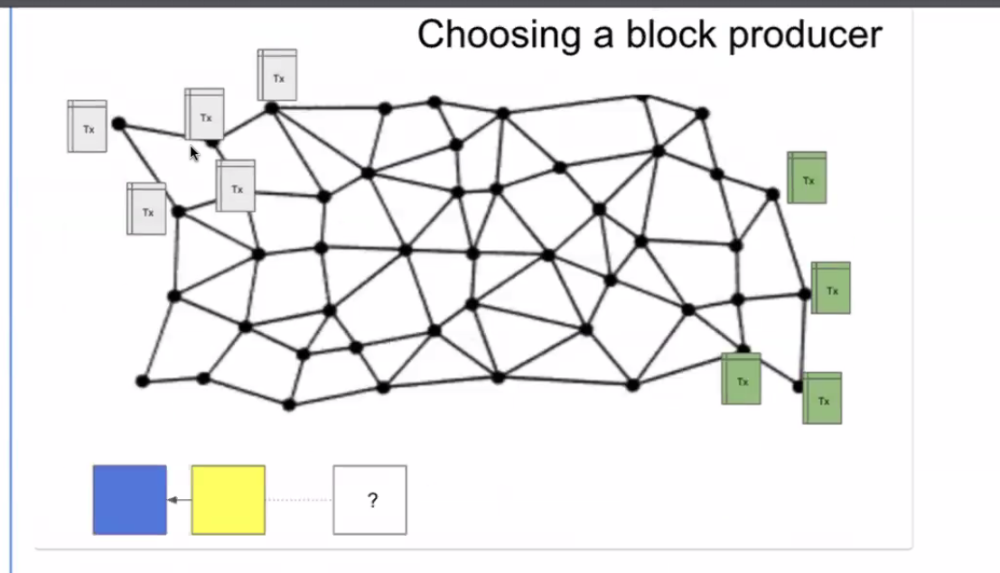
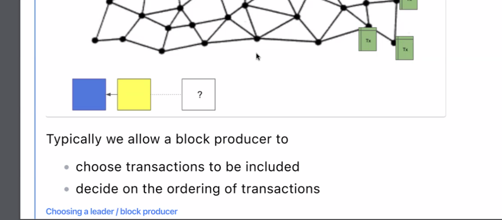

# Solana Bootcamp Q2 2024

## Lesson 1 - Monday - 6/3/24

anchor framework.

sli.do application. During lesson.

Discord Readme channel.

security auditing and development. But education is big focus.

IMP - put this in your overall knowledge category.

game theory -use economic incentive.. 

Imp = check the slide again what he said about this above pic.. 9:11AM. 

Data - little bit.

Imp - have chatGpt break down - Elliptic curves.

taking a point on curve and then take another point to guess something etc. .

diff algo work differently.

https://github.com/ExtropyIO/SolanaBootcamp

Slot- timestamps. Epochs.

Link before this - parent blockhash.

Child slot;;

Details of txns.

Block size is important factor.

IMP - what's BTC blocksize and WTH?

explorers:

TXns dont get picked up right away and are in pending state.

Ex BTC - 10 mins - mempool can get large. 

but ETH and SOL it ets complicated. MEV 

IMP - MEV - 

its public people know what Txns are happenning. Nodes can decide what to use based on that.

Block producers can extract more value. 

higher Txn fee they can pick.

lot of demand - large mempool.

Solana used improvements .. around scalability and speed. 

message works within Solana. 

Gossip protocol was unstructured way and unfocused. not geaographic proximity. etc .

mechanisms to improve on that. 

SOL - more targeted.

we know who the block produceer will be - so why dont we just send Txn to that person - then they can put in the block. Then they can pass it around. initially only producer needs it.

So main thing we know who wil be Leader (block producer).

This reduces load on the system. IMP - to make it more scalable etc

Deterministic Leader! IMP

QUestion - 

If we only send the txn to one single blockproducer, wouldn't that introduce a sense of centralisation? what if they don't include our txn?

Erick Fernandez

now

The rotating leader schedule reduces this risk by sending transactions to multiple validators

IMP - listen 925AM.

9:28 - concurrency.. listen again.

Txn 1 , 2 and 4 can be separated things out and run paraellel and then Txn 3.

IMP - gossip protocol - listen early and also research.

### Proof of History

There is no Clock available.

Block producer sequences Txns.

### Consensus 2 parts

random function used by some blockchains.

### liveness

if no producer is chosen? 

in BTC eventually someone will solve the puzzle.

If you assign slot - what is person chosen if offline or cant produce one? 
Then how do we proceed. part of the solution could be based on time slots.

Then next slot can produce the block.

So we need reliable source of time.

BFT is general name. 

Nakamotu consensus. 

crypto economic incentive to behave.

voting takes place among certain nodes - they dont scale very well. Since once you have lot of nodes it takes time. 

If some nodes dont vote.. some faults system has to proceed

Lesson 2 - 

there is no centralized auth for time.

hash - commit scheme that are binding. one way functions.

this has to be done sequentailly but we cna verify in parallel.

### homework

Question - 

Anonymous

15 minutes ago

Could you share a link to some resource on how solana manages to sync everything so quickly?

Erick Fernandez

13 minutes ago

Here's the Solana whitepaper: https://github.com/solana-labs/whitepaper/blob/master/solana-whitepaper-en.pdf

